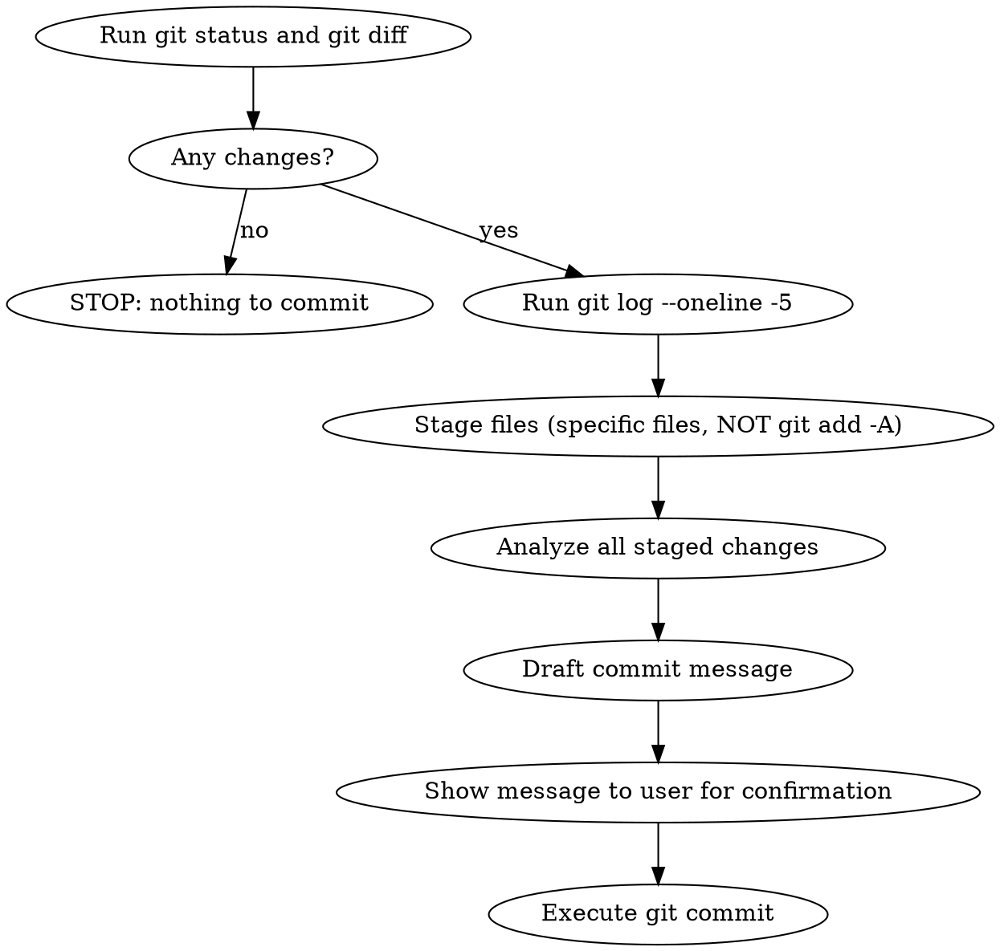

# Git Commit

Automate git commit with proper conventional commit message for the pls7-cli project.

## Process



## Commit Message Format

```
type(scope): short summary in English

Detailed description in English.
Explain WHY, not WHAT.

Key changes:
- Bullet points for specific changes

Co-Authored-By: Claude Opus 4.6 <noreply@anthropic.com>
```

### Type

Use one of: `feat`, `fix`, `refactor`, `test`, `docs`, `chore`, `perf`, `style`

### Scope

Use package or area name: `poker`, `engine`, `cli`, `config`, `rules`, `save`

### Examples from this repo

```
fix: delete big-blind flag
feat: add save&load func
docs(gemini): Add rule for commit and PR message language
```

## Rules

1. **Title and description MUST be in English.** (from .claude/skills/pls7-dev-rules/SKILL.md)
2. **Stage specific files by name.** Never use `git add -A` or `git add .` — avoid committing secrets or large binaries.
3. **Never commit `.env`, credentials, or save files** (`saves/` directory).
4. **Use HEREDOC** for multi-line commit messages to preserve formatting.
5. **Do NOT push** unless the user explicitly asks.
6. **If pre-commit hook fails**, fix the issue and create a NEW commit (never `--amend`). However, `--amend` is allowed for unpushed local commits when the user explicitly requests it.

## Execution Template

```bash
# 1. Gather context (run in parallel)
git status
git diff
git diff --staged
git log --oneline -5

# 2. Stage specific files
git add path/to/file1.go path/to/file2.go

# 3. Commit with HEREDOC
git commit -m "$(cat <<'EOF'
type(scope): short summary

Description here.

Co-Authored-By: Claude Opus 4.6 <noreply@anthropic.com>
EOF
)"

# 4. Verify
git status
```
