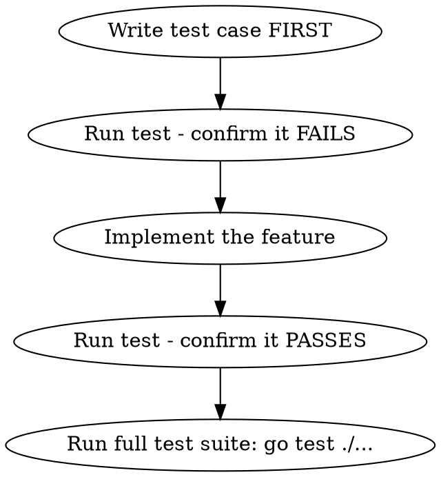

# pls7-cli Development Rules

Mandatory rules for all code changes in pls7-cli. Sourced from docs/GEMINI.md and CLAUDE.md.

## TDD is Required



**All feature additions use TDD.** No exceptions.
- Write test -> watch it fail -> implement -> watch it pass.
- Refactoring: write diverse test cases for the target logic BEFORE refactoring. All tests must pass after.

## Logging: Never Delete, Always Add

- **NEVER delete or modify existing `logrus` log statements**, regardless of level. Not even during refactoring. Logs are debugging evidence.
- **ADD `logrus` logs** for nested loops and complex logic so intermediate state changes are visible.
- **Log format**: Write logs in a format that is easy for AI to analyze later (structured, with context).

## Test Conventions

Player name slices MUST use this format:

```go
[]string{"YOU", "CPU1", "CPU2"}
```

- First player is always `"YOU"`
- Remaining players are `"CPUn"` (CPU1, CPU2, ...)
- Business logic is hardcoded around these names

## Code Language

- All **code comments** in English.
- All **documentation** in English.
- All **commit messages** in English (use `/commit` skill).

## Fail-Fast Rule

If an approach fails **more than twice**: STOP on the third attempt. Report to the user:
1. What was attempted
2. What failed and why
3. Wait for user's instructions

Do NOT brute-force retry.

## Quick Reference

| Rule | Detail |
|------|--------|
| TDD | Test first, fail, implement, pass |
| Logs | Never delete existing, add for complexity |
| Test names | `[]string{"YOU", "CPU1", "CPU2"}` |
| Comments | English only |
| Retries | Max 2 failures, stop on 3rd |
| Logging lib | `logrus` (never `fmt.Println` for debug) |
| Build check | `go build -v ./...` |
| Test check | `go test ./...` |
