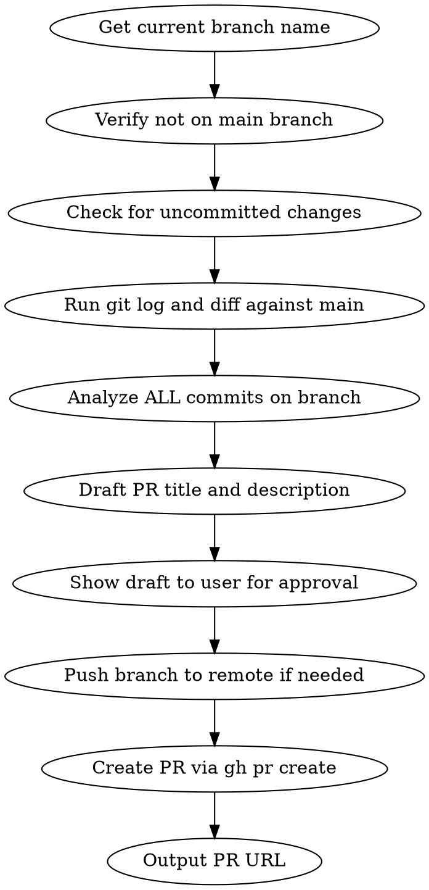

# PR Creator

Analyze the current branch, generate a PR title and description, and create the PR on GitHub via `gh pr create`.

## Process



## Pre-flight Checks

Before creating a PR, verify:

1. **Not on main branch**: If on `main`, abort and tell the user to switch to a feature branch.
2. **No uncommitted changes**: If there are uncommitted changes, warn the user and ask whether to proceed or commit first.
3. **gh CLI authenticated**: Run `gh auth status` to verify. If not authenticated, tell the user to run `gh auth login`.
4. **Branch has commits ahead of main**: If no commits ahead, abort.

## Data Gathering Commands

```bash
# Run these in parallel to gather context
git branch --show-current
git status --short
gh auth status
git log main..HEAD --oneline
git diff main...HEAD --stat
git diff main...HEAD
```

## PR Title and Description Format

**PR title**: English, under 70 chars, conventional commit style (e.g., `docs: rewrite project documentation with mermaid diagrams`).

**PR description** uses this template:

```
## Summary

- English bullet point 1
- English bullet point 2

## Changes

- Detailed change 1
- Detailed change 2

## Test plan

- [ ] Test item 1
- [ ] Test item 2

---

## 요약

- 위 영문 Summary의 한국어 번역

## 변경 사항

- 위 영문 Changes의 한국어 번역

## 테스트 계획

- [ ] 위 Test plan의 한국어 번역
```

## Creating the PR

After the user approves the draft:

1. **Push branch** to remote if not already pushed:
   ```bash
   git push -u origin <branch-name>
   ```

2. **Create PR** using `gh pr create` with HEREDOC for the body:
   ```bash
   gh pr create --title "the pr title" --body "$(cat <<'EOF'
   ## Summary
   ...body content...
   EOF
   )"
   ```

3. **Output the PR URL** returned by `gh pr create`.

## Rules

1. **PR title**: English, under 70 chars, conventional commit style.
2. **PR description**: English FIRST, then Korean translation appended below a `---` separator.
3. **Analyze ALL commits** on the branch, not just the latest one.
4. **Always show the draft** to the user and get approval before creating the PR.
5. **Always push** the branch before creating the PR.
6. **Target branch**: Always `main` unless the user specifies otherwise.
7. **On error**: If `gh pr create` fails, show the error message and suggest fixes (e.g., branch already has a PR, authentication issue).
