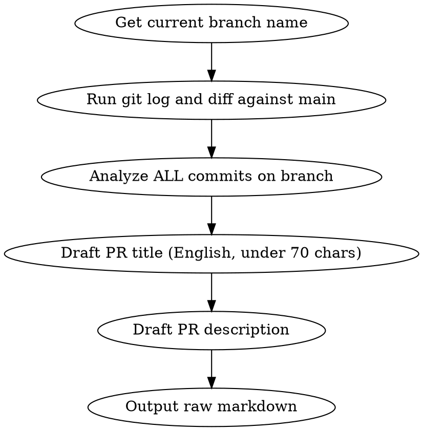

# PR Message Generator

Generate a PR title and description for the pls7-cli project. Outputs raw markdown — does NOT create the PR.

## Process



## Output Format

Output MUST be raw markdown, no line numbers, directly copy-pasteable. (from docs/GEMINI.md rule)

````
## PR Title

type(scope): short summary in English

## PR Description

### Summary (English)

- Bullet point 1
- Bullet point 2

### Changes

- Detailed change 1
- Detailed change 2

### Test plan

- [ ] Test item 1
- [ ] Test item 2

---

### 요약 (한국어)

- 위 영문 Summary의 한국어 번역

### 변경 사항

- 위 영문 Changes의 한국어 번역

### 테스트 계획

- [ ] 위 Test plan의 한국어 번역
````

## Rules

1. **PR title**: English, under 70 chars, conventional commit style.
2. **PR description**: English FIRST, then Korean translation appended below a `---` separator. (from docs/GEMINI.md: "PR description은 영어로 먼저 작성하고, 그 뒤에 한국어 번역을 덧붙여 작성해")
3. **No line numbers** in the output. Must be copy-paste friendly.
4. **Analyze ALL commits** on the branch, not just the latest one.
5. **Do NOT create the PR.** Only output the message.

## Data Gathering Commands

```bash
# Run these in parallel to gather context
git branch --show-current
git log main..HEAD --oneline
git diff main...HEAD --stat
git diff main...HEAD
```
