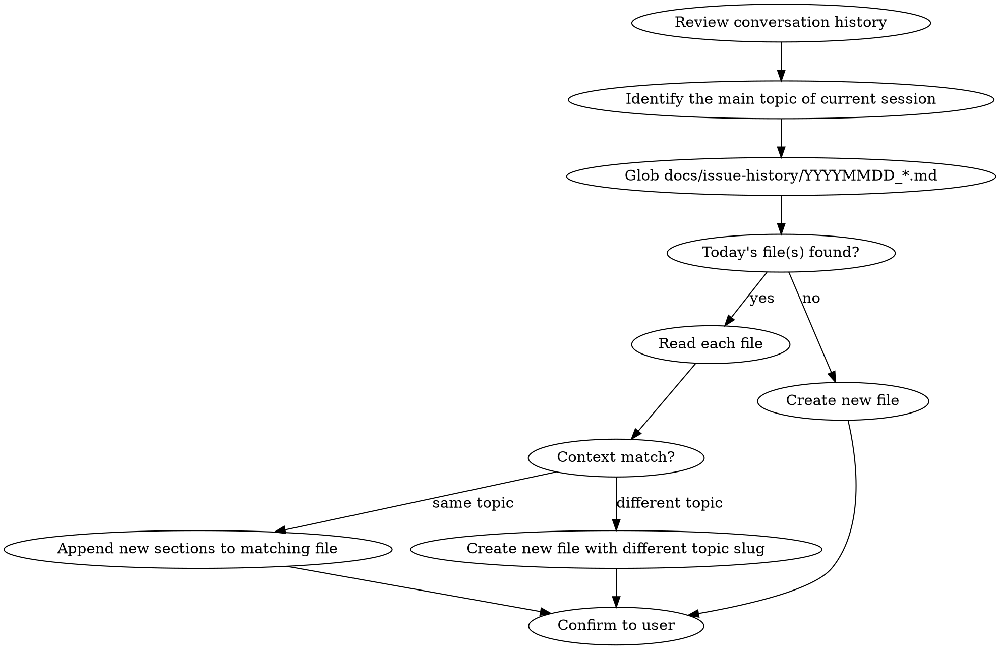

# Work Log Generator

Generate or update a work log document in `docs/issue-history/` summarizing the current session's work.

## Process



## Append vs Create: Context Matching

Date alone is NOT sufficient. You must compare the **topic/context** of the current session against existing files.

**Steps:**
1. Glob for `docs/issue-history/YYYYMMDD_*.md` using today's date.
2. If file(s) found, **read each one** and summarize its topic in one sentence.
3. Summarize the current session's work topic in one sentence.
4. **Compare**: Are they the same logical stream of work?
   - **Same context** (e.g., both about "setting up Claude Code and skills"): Append to the existing file. Continue numbering from the last 요청 N.
   - **Different context** (e.g., existing is about "skills setup", new work is about "AI betting logic bug"): Create a new file with a different topic slug.

**Examples:**
- Existing: `20260210_setup_claude_code_and_skills.md` / New work: refining those same skills → **append**
- Existing: `20260210_setup_claude_code_and_skills.md` / New work: fixing a pot distribution bug → **new file** `20260210_fix_pot_distribution_bug.md`

## Filename Convention

```
docs/issue-history/YYYYMMDD_snake_case_topic.md
```

- Date: today's date in `YYYYMMDD` format
- Topic: short snake_case description of the session's main theme
- Examples from this repo:
  - `20250801_bug_fix_in_distribute_pot.md`
  - `20250826_separation_of_concerns.md`
  - `20250903_support_plo_and_plo8.md`

## Document Structure

Each request/task in the session becomes a section:

```markdown
## 요청 N: Short title

Brief description of what was requested.

## 작업 내용

- What was done
- Files created/modified
- Key decisions made

---
```

## Rules

1. **Always search and read today's files first** before deciding to append or create.
2. **Context match determines append vs create** — not date alone.
3. **Append only new work** — never rewrite or duplicate existing sections.
4. **Continue numbering** from the last 요청 number when appending.
5. **Review the full conversation** to capture all work done since the last log update.
6. **Write section titles in Korean** (요청, 작업 내용) to match existing documents in this repo.
7. **Be factual** — record what was done, not opinions or recommendations.
8. **List affected files** so the document serves as a change reference.
