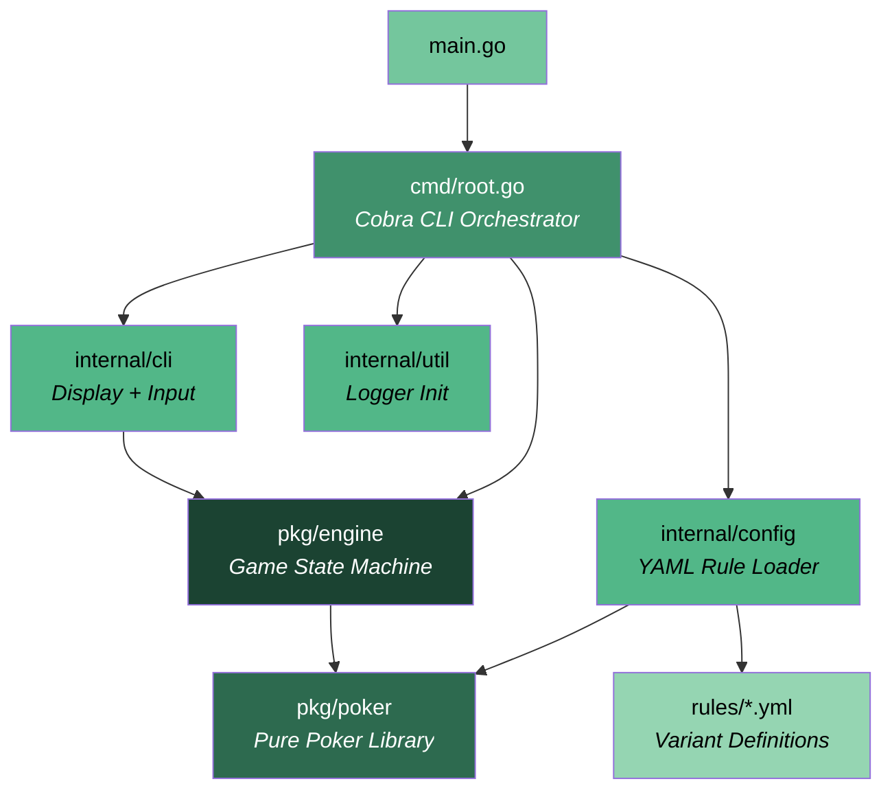
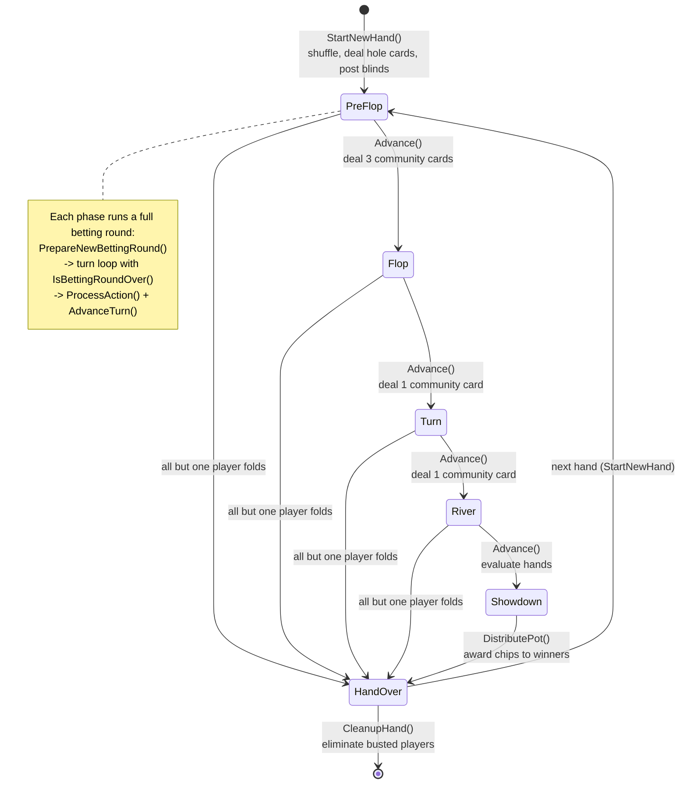
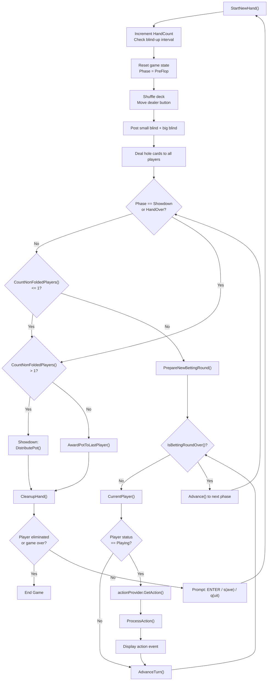
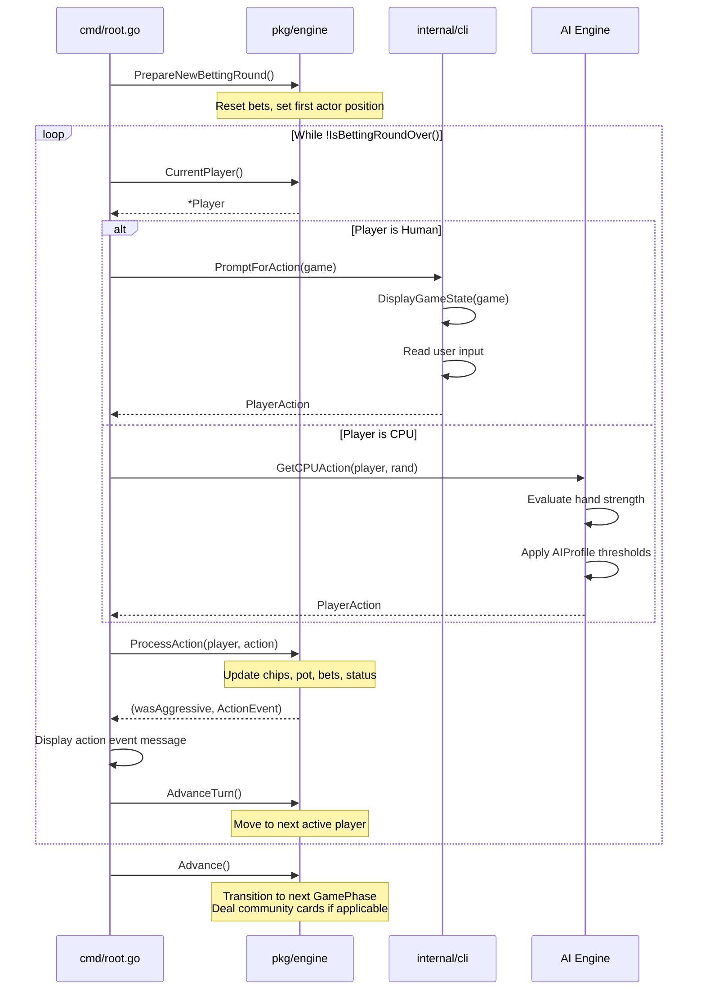
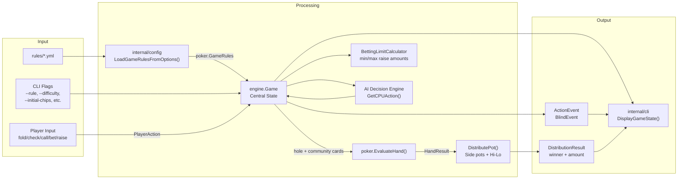
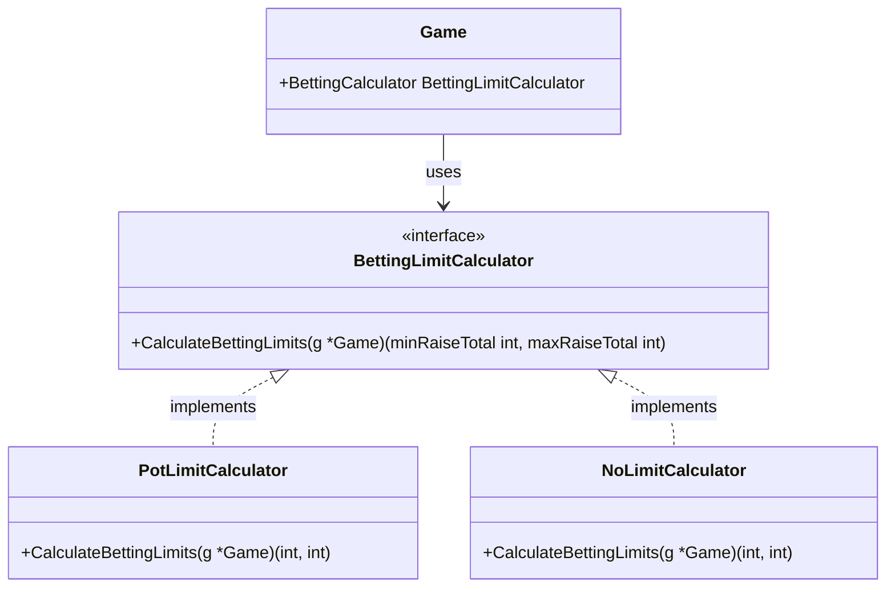
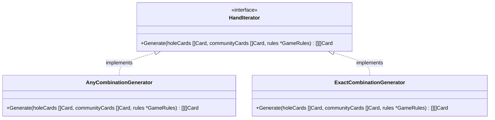
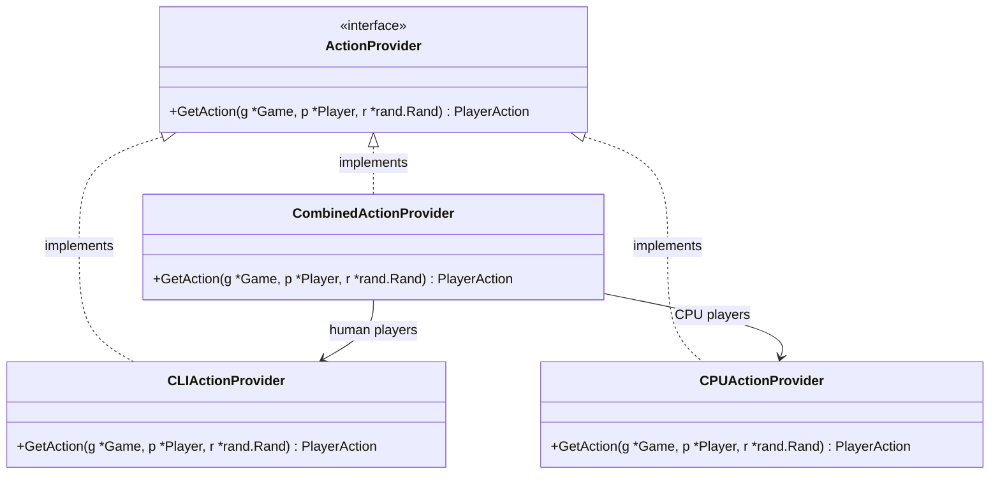
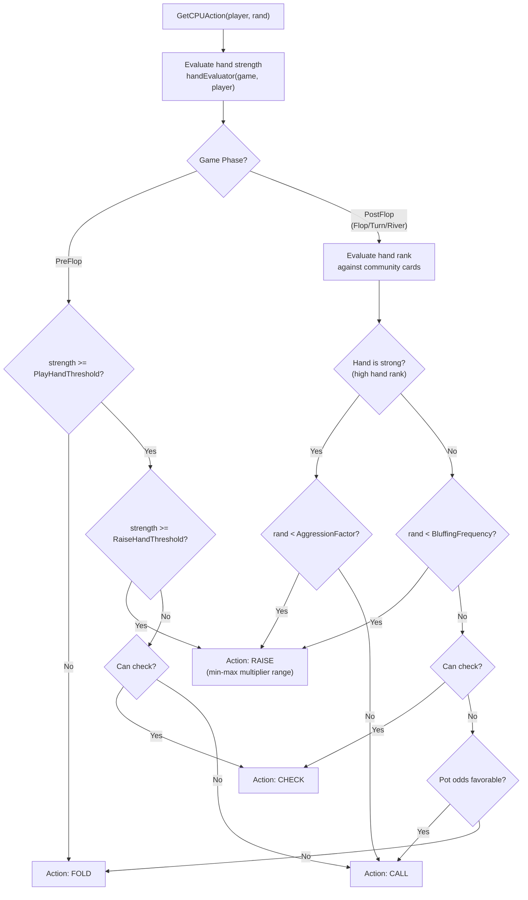
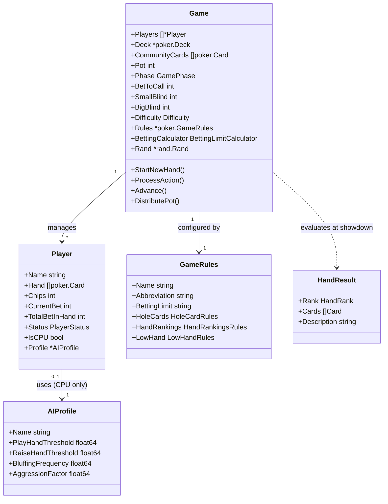

# Architecture

This is the canonical architecture document for `pls7-cli`. It covers the three-layer design, package responsibilities, dependency flow, key design patterns, game flow, AI system, supported poker variants, and project layout.

---

## Table of Contents

1. [High-Level Overview](#high-level-overview)
2. [Package Dependency Diagram](#package-dependency-diagram)
3. [Package Responsibilities](#package-responsibilities)
4. [Project Layout](#project-layout)
5. [Game State Machine](#game-state-machine)
6. [Single Hand Execution Flow](#single-hand-execution-flow)
7. [Betting Round Sequence](#betting-round-sequence)
8. [Data Flow Diagram](#data-flow-diagram)
9. [Key Design Patterns](#key-design-patterns)
10. [AI Decision System](#ai-decision-system)
11. [Supported Variants](#supported-variants)
12. [Save/Load System](#saveload-system)
13. [CLI Flags and Subcommands](#cli-flags-and-subcommands)

---

## High-Level Overview

pls7-cli is a CLI poker game engine built on a strict three-layer architecture with unidirectional dependency flow:

```
CLI Layer  -->  Engine Layer  -->  Poker Library
```

- **Poker Library (`pkg/poker`)** -- A pure, zero-dependency poker library. It knows about cards, decks, hand evaluation, odds calculation, and game rules. It has no knowledge of game state, players, or turns.
- **Game Engine (`pkg/engine`)** -- A state machine that manages the full lifecycle of a poker game: players, pot, phases, betting rounds, AI decisions, and save/load. It consumes `pkg/poker` for rule enforcement and hand evaluation.
- **CLI Application (`cmd/root.go`, `internal/cli`, `internal/config`)** -- The user-facing orchestration layer. It parses flags, loads YAML rules, runs the main game loop, renders the terminal UI, and captures player input.

This decoupled design makes the core engine portable. The CLI could be replaced with a web UI, GUI, or network server without modifying `pkg/poker` or `pkg/engine`.

---

## Package Dependency Diagram



**Dependency rules:**
- `pkg/poker` has **zero** internal dependencies. It is the foundation layer.
- `pkg/engine` depends **only** on `pkg/poker`.
- `internal/*` packages depend on `pkg/engine` and/or `pkg/poker`, but never on `cmd`.
- `cmd/root.go` ties everything together and depends on all layers.

---

## Package Responsibilities

### `pkg/poker` -- Pure Poker Library

| File | Responsibility |
|------|---------------|
| `card.go` | `Card`, `Suit`, `Rank` types; string parsing (`CardsFromStrings`) |
| `deck.go` | `Deck` with `Shuffle`, `Deal`, `DealForDebug`; deterministic RNG for save/load reproducibility |
| `combinations.go` | Recursive card combination generator for building all possible 5-card hands |
| `evaluation.go` | Hand evaluation engine with `HandRank` enum (HighCard through RoyalFlush, plus SkipStraight and SkipStraightFlush); `HandResult` struct; Hi-Lo evaluation support |
| `hand_iterator.go` | `HandIterator` interface (Strategy Pattern) with `AnyCombinationGenerator` and `ExactCombinationGenerator` |
| `odds.go` | `OutsInfo` struct; `CalculateOuts` (checks for draws to better hands); `CalculateEquity` (rule of 2 and 4); pot odds calculation |
| `rules.go` | `GameRules`, `HoleCardRules`, `HandRankingsRules`, `LowHandRules` structs with YAML tags |
| `format.go` | `JoinStrings` utility |

### `pkg/engine` -- Game State Machine

| File | Responsibility |
|------|---------------|
| `game.go` | `Game` struct (central state container), `GamePhase` enum, `NewGame` constructor |
| `run.go` | Core game loop methods: `StartNewHand`, `PrepareNewBettingRound`, `IsBettingRoundOver`, `ProcessAction`, `AdvanceTurn`, `Advance` (phase transitions), `CleanupHand` |
| `action.go` | `ActionType` enum (Fold/Check/Call/Bet/Raise), `PlayerAction` struct, `ActionProvider` interface |
| `player.go` | `Player` struct, `PlayerStatus` enum (Playing/Folded/AllIn/Eliminated), `AIProfile` struct |
| `ai.go` | AI decision engine with 4 profiles (TAG/LAG/TAP/LAP); pre-flop heuristics and post-flop hand rank-based decisions |
| `betting_limit.go` | `BettingLimitCalculator` interface (Strategy Pattern) with `PotLimitCalculator` and `NoLimitCalculator` |
| `pot.go` | `DistributePot` with side pot handling and Hi-Lo split logic; `PotTier`, `DistributionResult` structs |
| `config.go` | `Difficulty` enum (Easy/Medium/Hard) |
| `event.go` | `ActionEvent` and `BlindEvent` for UI communication |
| `save.go` | `GameSaveData`, `GameMetadata`, `PlayerSaveData`, `GameSettings` structs; serialization/deserialization |
| `save_manager.go` | `SaveManager` for file I/O operations (save, load, list, validate, delete) |

### `cmd/root.go` -- Cobra CLI Orchestrator

- `CombinedActionProvider` dispatches to `CLIActionProvider` (human) or `CPUActionProvider` (AI) based on `Player.IsCPU`
- Runs the main multi-hand game loop
- Registers CLI flags and subcommands (`saves list`, `saves validate`, `saves delete`)

### `internal/cli` -- Terminal UI

| File | Responsibility |
|------|---------------|
| `display.go` | Renders game state (board, players, pot, phase) to the terminal |
| `input.go` | `PromptForAction` -- captures and validates player input, translates to `engine.PlayerAction` |
| `format.go` | `FormatNumber` -- number formatting helper |

### `internal/config` -- Rule Loading

| File | Responsibility |
|------|---------------|
| `rules.go` | `LoadGameRulesFromFile`, `LoadGameRulesFromOptions` -- reads `rules/*.yml` and unmarshals into `poker.GameRules` |

### `internal/util` -- Utilities

| File | Responsibility |
|------|---------------|
| `logger.go` | `InitLogger` -- configures `logrus` based on dev mode |

### `rules/*.yml` -- Variant Definitions

YAML files that define each poker variant's parameters (hole card count, use constraints, betting limits, custom hand rankings, low hand rules). See [Supported Variants](#supported-variants) for details.

---

## Project Layout

```text
pls7-cli/
|-- .claude/                 # Claude Code settings and project-specific skills
|-- .github/workflows/       # CI workflow for Go build and tests
|-- cmd/                     # Cobra CLI entry point and runtime orchestration
|-- docs/
|   |-- adr/                 # Future Architecture Decision Records
|   |-- archive/             # Historical roadmaps, issue notes, superseded docs
|   |-- images/              # Documentation images
|   |-- ko/                  # Korean supporting references
|   `-- specs/               # Active feature and documentation specs
|-- internal/
|   |-- cli/                 # Terminal display and input
|   |-- config/              # YAML rule loading
|   `-- util/                # Application utilities
|-- pkg/
|   |-- engine/              # Game state machine
|   `-- poker/               # Pure poker library
|-- rules/                   # YAML variant definitions
|-- saves/                   # Runtime save files
|-- AGENTS.md                # Canonical agent and contributor rules
|-- ARCHITECTURE.md          # This document
|-- DEVELOPMENT.md           # Local development workflow
|-- README.md                # User-facing project entry point
|-- go.mod / go.sum          # Go module files
`-- main.go                  # Application entry point
```

Key layout rules:

- `pkg/poker` stays reusable and independent.
- `pkg/engine` owns game behavior and should remain UI-agnostic.
- `internal/*` is application-specific and private to this module.
- `cmd/root.go` wires the CLI experience together.
- `rules/*.yml` stores game variant data, not executable logic.
- `docs/archive/` is historical; active guidance belongs in root documents or `docs/specs/`.

---

## Game State Machine

The game progresses through a well-defined sequence of phases. Each phase corresponds to a betting round (except Showdown and HandOver).



**Phase transitions in code (`Advance()` method):**

| From | To | Community Cards Dealt |
|------|----|-----------------------|
| PreFlop | Flop | 3 cards |
| Flop | Turn | 1 card |
| Turn | River | 1 card |
| River | Showdown | 0 (evaluate hands) |
| Showdown | HandOver | 0 (distribute pot) |

---

## Single Hand Execution Flow

This diagram shows the complete lifecycle of a single poker hand, from initialization through conclusion.



---

## Betting Round Sequence

This sequence diagram shows the turn-by-turn interaction within a single betting round.



---

## Data Flow Diagram

This diagram shows how data flows through the system from configuration to game outcome.



---

## Key Design Patterns

### 1. Strategy Pattern -- BettingLimitCalculator

The `BettingLimitCalculator` interface decouples the game engine from specific betting structures. The appropriate calculator is injected at game creation time based on the `GameRules.BettingLimit` field.



- **PotLimitCalculator**: Maximum raise = pot size after call. Used by PLS7, PLS, PLO, PLO8.
- **NoLimitCalculator**: Maximum raise = player's entire chip stack. Used by NLH.

### 2. Strategy Pattern -- HandIterator

The `HandIterator` interface handles the different rules for forming 5-card hands from hole cards and community cards.



- **AnyCombinationGenerator**: Picks the best 5 from the combined pool of hole + community cards. Used by NLH (`use_constraint: "any"`), PLS7, and PLS.
- **ExactCombinationGenerator**: Must use exactly N hole cards and (5-N) community cards. Used by PLO and PLO8 (`use_constraint: "exact"`, `use_count: 2`).

### 3. ActionProvider Interface

The `ActionProvider` interface decouples the game engine from the source of player input, enabling different input strategies for human and CPU players.



`CombinedActionProvider` is the concrete implementation used at runtime. It checks `Player.IsCPU` to determine whether to prompt the human via `internal/cli` or compute a decision via the AI engine.

### 4. Injectable Hand Evaluator

The `Game` struct holds a `handEvaluator` function field that can be replaced in tests for predictable outcomes:

```go
handEvaluator func(g *Game, player *Player) float64
```

This allows unit tests to inject a fixed evaluator, removing randomness from AI behavior during testing.

---

## AI Decision System

CPU players are assigned an `AIProfile` based on the game's `Difficulty` setting. Each profile controls play thresholds, aggression, and bluffing behavior.

### AI Profiles

| Profile | PlayHandThreshold | RaiseHandThreshold | BluffFreq | Aggression | Style |
|---------|------------------:|-------------------:|----------:|-----------:|-------|
| Tight-Aggressive (TAG) | 20 | 25 | 0.15 | 0.70 | Selective but aggressive when playing |
| Loose-Aggressive (LAG) | 10 | 20 | 0.35 | 0.90 | Plays many hands, bets/raises often |
| Tight-Passive (TAP) | 22 | 28 | 0.05 | 0.30 | Very selective, prefers calling |
| Loose-Passive (LAP) | 8 | 24 | 0.10 | 0.20 | Plays many hands, rarely raises |

### AI Decision Flowchart



### Difficulty and Profile Assignment

| Difficulty | Profile Mix |
|------------|------------|
| Easy | Primarily LAP and TAP profiles (passive, predictable play) |
| Medium | Mixed profiles across all four types |
| Hard | Primarily TAG and LAG profiles (aggressive, strategic play) |

---

## Supported Variants

pls7-cli supports five poker variants, each defined by a YAML configuration file in the `rules/` directory.

### Variant Comparison Table

| Feature | PLS7 | PLS | NLH | PLO | PLO8 |
|---------|------|-----|-----|-----|------|
| **Full Name** | Pot-Limit Sampyeong 7-or-Better | Pot-Limit Sampyeong | No-Limit Texas Hold'em | Pot-Limit Omaha | Pot-Limit Omaha 8-or-Better |
| **Hole Cards** | 3 | 3 | 2 | 4 | 4 |
| **Use Constraint** | any | any | any | exact 2 | exact 2 |
| **Betting Limit** | Pot-Limit | Pot-Limit | No-Limit | Pot-Limit | Pot-Limit |
| **Hand Rankings** | Custom (with SkipStraight, SkipStraightFlush) | Custom (with SkipStraight, SkipStraightFlush) | Standard | Standard | Standard |
| **Hi-Lo Split** | Yes (7-or-Better) | No | No | No | Yes (8-or-Better) |
| **YAML File** | `rules/pls7.yml` | `rules/pls.yml` | `rules/nlh.yml` | `rules/plo.yml` | `rules/plo8.yml` |
| **HandIterator** | AnyCombinationGenerator | AnyCombinationGenerator | AnyCombinationGenerator | ExactCombinationGenerator | ExactCombinationGenerator |
| **BettingCalculator** | PotLimitCalculator | PotLimitCalculator | NoLimitCalculator | PotLimitCalculator | PotLimitCalculator |

### Custom Hand Rankings (PLS7 and PLS)

PLS7 and PLS use custom hand rankings that insert two additional hand types into the standard hierarchy:

```
Royal Flush > Skip Straight Flush > Straight Flush > Four of a Kind
> Full House > Skip Straight > Flush > Straight > Three of a Kind
> Two Pair > One Pair > High Card
```

A **Skip Straight** (also called a "gapped straight") consists of cards with alternating ranks (e.g., A-Q-T-8-6). A **Skip Straight Flush** is the same pattern in a single suit.

### Hi-Lo Split

In Hi-Lo variants (PLS7 and PLO8), the pot is split between the best high hand and the best qualifying low hand. A qualifying low hand consists of five unique cards with ranks at or below the variant's `max_rank` threshold (7 for PLS7, 8 for PLO8). If no player has a qualifying low hand, the entire pot is awarded to the best high hand.

---

## Save/Load System

The save/load system allows players to persist game state between sessions.

### Save Data Structure

```
GameSaveData
  +-- Timestamp
  +-- GameMetadata
  |     +-- HandCount, DealerPos
  |     +-- SmallBlind, BigBlind, BlindUpInterval
  |     +-- TotalInitialChips
  +-- Players[] (PlayerSaveData)
  |     +-- Name, Chips, IsCPU
  |     +-- ProfileName, Status
  +-- GameRules (poker.GameRules)
  +-- Settings (GameSettings)
        +-- Difficulty, DevMode, ShowsOuts
```

Save files are stored as JSON in the `saves/` directory with timestamp-based filenames (e.g., `save_20250101_120000.json`).

### Save Management Commands

| Command | Description |
|---------|------------|
| `pls7 saves list` | List all saved games with metadata |
| `pls7 saves validate [filename]` | Validate that a save file can be loaded |
| `pls7 saves delete [filename]` | Delete a save file (with confirmation) |
| `--load` | Load the most recent save file at startup |
| `--load-file [filename]` | Load a specific save file at startup |

---

## CLI Flags and Subcommands

### Root Command Flags

| Flag | Short | Default | Description |
|------|-------|---------|-------------|
| `--rule` | `-r` | `pls7` | Game variant to use (pls7, pls, nlh, plo, plo8) |
| `--difficulty` | `-d` | `medium` | AI difficulty level (easy, medium, hard) |
| `--dev` | -- | `false` | Enable development mode with verbose logging |
| `--debug-hand` | -- | `""` | Select debug hand by key (requires `--dev`). Use `debug-hands` command to list keys. |
| `--outs` | -- | `false` | Show outs information for the player |
| `--big-blind` | -- | `1000` | Big blind amount (must be even, ≥ 2). Small blind is half. |
| `--blind-up` | -- | `10` | Number of hands per blind level (0 = disabled) |
| `--initial-chips` | -- | `300000` | Starting chip count for each player |
| `--load` | `-l` | `false` | Load the most recent saved game |
| `--load-file` | -- | `""` | Load a specific saved game file |
| `--save-dir` | -- | `saves` | Directory for save files |

### In-Game Controls

Between hands, the player can:
- Press **ENTER** to start the next hand
- Type **s** to save the current game state
- Type **q** to quit the game

---

## Key Data Structures

### Core Structs Relationship



### GamePhase Enum

| Value | Name | Description |
|-------|------|-------------|
| 0 | PreFlop | First betting round after hole cards are dealt |
| 1 | Flop | Second betting round after 3 community cards |
| 2 | Turn | Third betting round after 4th community card |
| 3 | River | Final betting round after 5th community card |
| 4 | Showdown | Hand evaluation and pot distribution |
| 5 | HandOver | Cleanup phase, ready for next hand |

### PlayerStatus Enum

| Value | Name | Description |
|-------|------|-------------|
| 0 | Playing | Actively participating in the current hand |
| 1 | Folded | Has folded and is out of the current hand |
| 2 | AllIn | Has committed all remaining chips |
| 3 | Eliminated | Has no chips and is out of the game entirely |

### ActionType Enum

| Value | Name | Description |
|-------|------|-------------|
| 0 | Fold | Forfeit the hand |
| 1 | Check | Pass without betting (only when no open bet) |
| 2 | Call | Match the current bet |
| 3 | Bet | Place the first bet in a round |
| 4 | Raise | Increase an existing bet |
