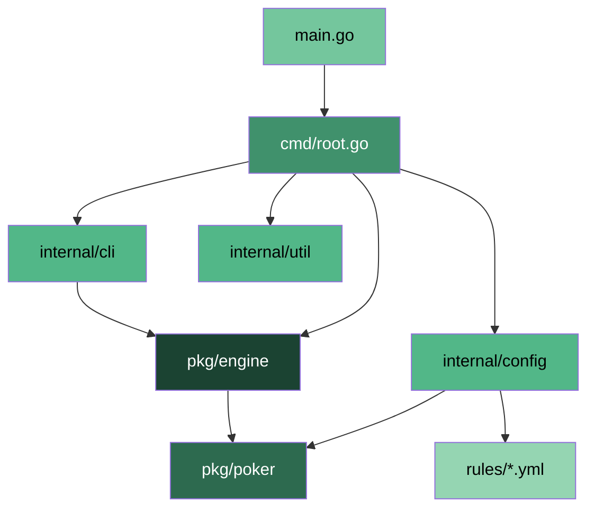

# pls7-cli

**A CLI poker game engine supporting multiple poker variants with AI opponents.**

[](https://github.com/gotchamen/pls7-cli/actions/workflows/go.yml)

[](https://github.com/gotchamen/pls7-cli/blob/main/LICENSE)

---

## Overview

pls7-cli is a terminal-based poker game engine written in Go. It ships with five poker variants -- from the Korean community favorite PLS7 (Pot-Limit Sampyeong 7-or-Better) to classics like No-Limit Texas Hold'em and Pot-Limit Omaha. Play against AI opponents whose personality profiles and difficulty scale to your level, save and resume sessions at any time, and tweak every game parameter through CLI flags or YAML rule files.

## What is PLS7?

PLS7 (Pot-Limit Sampyeong 7-or-Better) is a Hi-Lo split poker variant popular in the Korean poker community. Players receive 3 hole cards, must use exactly 2 to form a hand, and compete for both a high pot and a low pot (qualifying hands must be 7-or-better). It features skip-straight rankings and pot-limit betting.

Learn more:

- [PLS7 Game Guide (English)](https://philipjkim.github.io/posts/20250729-pls7-english-guide/)
- [PLS7 Game Guide (Korean)](https://philipjkim.github.io/posts/20250724-sampyeong-holdem-guide-v1-4/)

## Architecture

pls7-cli follows a strict three-layer architecture: **CLI -> Engine -> Poker Library**.



| Layer | Package | Responsibility |
|-------|---------|----------------|
| Poker Library | `pkg/poker` | Cards, decks, hand evaluation, odds calculation, game rules (zero internal dependencies) |
| Engine | `pkg/engine` | Game state machine, AI decision-making, save/load, pot distribution, betting limits |
| CLI | `cmd/`, `internal/cli` | Terminal UI, user input, display formatting, main game loop |

## Features

- **5 poker variants** defined via YAML rule files -- easy to extend with new variants
- **AI opponents** with 4 personality profiles (TAG, LAG, TAP, LAP) across 3 difficulty levels
- **Save/load** game state to JSON at any point during play
- **Configurable parameters** -- initial chips, blinds, blind-up intervals, and more
- **Outs and equity display** in development mode for hand analysis
- **Hi-Lo split pots** with proper side-pot calculation

## Supported Variants

| Variant | Full Name | Hole Cards | Betting | Hi-Lo |
|---------|-----------|:----------:|---------|:-----:|
| PLS7 | Pot-Limit Sampyeong 7-or-Better | 3 | Pot-Limit | Yes (7) |
| PLS | Pot-Limit Sampyeong | 3 | Pot-Limit | No |
| NLH | No-Limit Texas Hold'em | 2 | No-Limit | No |
| PLO | Pot-Limit Omaha | 4 | Pot-Limit | No |
| PLO8 | Pot-Limit Omaha 8-or-Better | 4 | Pot-Limit | Yes (8) |

## Quick Start

### Prerequisites

Go 1.23 or higher is required.

### Installation

#### macOS (Homebrew)

```bash
brew install go
```

#### Windows

Download and run the MSI installer from the [official Go downloads page](https://go.dev/dl/). The installer adds Go to your system PATH automatically.

#### Verify Installation

```bash
go version
```

### Clone and Run

```bash
git clone https://github.com/gotchamen/pls7-cli.git
cd pls7-cli
go mod tidy
go run main.go
```

## Usage

```
go run main.go [flags]
go run main.go saves [list|validate|delete] [args]
```

### CLI Flags

| Flag | Short | Type | Default | Description |
|------|:-----:|------|---------|-------------|
| `--rule` | `-r` | string | `pls7` | Game variant (`pls7`, `pls`, `nlh`, `plo`, `plo8`) |
| `--difficulty` | `-d` | string | `medium` | AI difficulty (`easy`, `medium`, `hard`) |
| `--big-blind` | | int | `1000` | Big blind amount (must be even, ≥ 2). Small blind is half. |
| `--blind-up` | | int | `10` | Hands per blind level (`0` = disabled) |
| `--dev` | | bool | `false` | Development mode with verbose logging |
| `--debug-hand` | | string | `""` | Select debug hand by key (requires `--dev`). Use `debug-hands` command to list keys. |
| `--outs` | | bool | `false` | Show hand outs for the human player |
| `--load` | `-l` | bool | `false` | Load the most recent saved game |
| `--load-file` | | string | `""` | Load a specific saved game file |
| `--save-dir` | | string | `saves` | Directory for save files |
| `--initial-chips` | | int | `300000` | Starting chips per player |

### Examples

```bash
# Start a default PLS7 game (medium difficulty)
go run main.go

# Play Pot-Limit Sampyeong
go run main.go --rule pls

# Play No-Limit Hold'em with easy AI and outs display
go run main.go -r nlh -d easy --outs

# Play Pot-Limit Omaha with hard AI
go run main.go -r plo -d hard

# Play PLO8 (Pot-Limit Omaha Hi-Lo)
go run main.go -r plo8

# Custom chip stack and blinds
go run main.go --initial-chips 500000 --big-blind 2000

# Disable blind increases
go run main.go --blind-up 0

# Development mode for debugging
go run main.go --dev

# Load the most recent saved game
go run main.go --load

# Load a specific save file
go run main.go --load-file save_20260101_120000
```

## Game Controls

### Between Hands

| Key | Action |
|-----|--------|
| `ENTER` | Continue to the next hand |
| `s` | Save the current game state |
| `q` | Quit the game |

### Betting Actions

| Key | Action |
|-----|--------|
| `f` | Fold -- forfeit your hand |
| `c` | Call -- match the current bet |
| `r` | Raise -- increase the bet |
| `k` | Check -- pass without betting (when no bet is required) |
| `b` | Bet -- make the first bet in a round |
| `s` | Save -- save the current game state |

## Save / Load

Games are saved as JSON files in the `saves/` directory (configurable with `--save-dir`).

```bash
# List all saved games
go run main.go saves list

# Validate a save file
go run main.go saves validate <filename>

# Delete a save file
go run main.go saves delete <filename>
```

## Building

```bash
# Build all packages
go build -v ./...

# Create a standalone executable
go build -o pls7 main.go

# Run the executable directly
./pls7
./pls7 -r nlh -d hard
```

## Testing

```bash
# Run all tests
go test ./...

# Run all tests with verbose output
go test -v ./...

# Run tests for a specific package
go test -v ./pkg/engine/...

# Run a single test
go test -v -run TestFuncName ./pkg/engine/
```

## Documentation

- [Architecture (EN)](./docs/architecture.md)
- [Architecture (KO)](./docs/architecture_ko.md)
- [Directory Structure (EN)](./docs/directory_structure.md)
- [Directory Structure (KO)](./docs/directory_structure_ko.md)
- [Roadmap (KO)](./docs/roadmap_v20260211.md)
- [Roadmap - Legacy (KO)](./docs/roadmap_v20250827.md)

## Contributing

This project uses [Claude Code](https://claude.ai/code) as its primary AI development tool. Development conventions, TDD requirements, and coding standards are documented in [CLAUDE.md](./CLAUDE.md).

## License

See [LICENSE](./LICENSE) for details.
