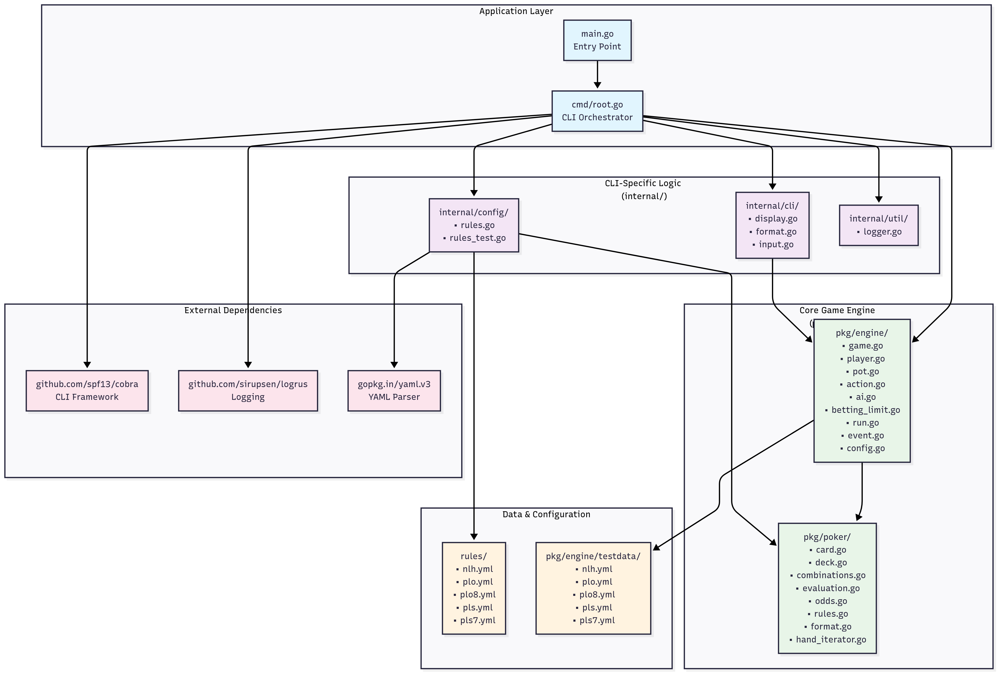

# Application Architecture

This document provides a high-level overview of the `pls7-cli` architecture, its key components, and their interactions.

## High-Level Overview

The application is designed with a clear separation of concerns, consisting of two main parts:

1.  **Poker Engine (`pkg/poker`)**: A self-contained, reusable library that encapsulates the rules and logic of poker. It has no knowledge of the user interface or the application's main flow.
2.  **CLI Application (`cmd`, `internal`)**: The user-facing part of the project that consumes the poker engine. It handles user input, displays game state, and manages the overall game progression.

This decoupled architecture makes the core engine portable and allows the user interface to be swapped (e.g., to a web UI) with minimal changes to the underlying game logic.

## Dependency Diagram

The diagram below illustrates the dependency flow between the major packages.

```mermaid
graph TD
    subgraph Application
        main --> cmd
    end

    subgraph "Internal Logic"
        cmd --> internal_cli("internal/cli")
        cmd --> internal_game("internal/game")
        cmd --> internal_config("internal/config")
        internal_cli --> internal_game
    end

    subgraph "Core Poker Engine"
        internal_game --> pkg_poker("pkg/poker")
        internal_config --> pkg_poker
    end
    
    subgraph "Data"
        internal_config --> rules("rules/*.yml")
    end
```

*   **`cmd`** is the central orchestrator, depending on all `internal` packages.
*   **`internal/config`** and **`internal/game`** both depend on the **`pkg/poker`** engine.
*   **`pkg/poker`** is the core, independent engine with no internal dependencies.
*   **`rules/`** contains data-only YAML files that configure the engine via `internal/config`.

## Package Responsibilities

*   **`rules/` (YAML Files)**
    *   Acts as a "database" for poker rules. Each file defines a variant (NLH, PLS7, etc.) by specifying parameters like hole card count, betting limits, and hand rankings.

*   **`pkg/poker` (The Engine)**
    *   **Responsibility**: To be a pure, state-agnostic poker library.
    *   It knows how to evaluate hands, what a `Card` or `Deck` is, and how to calculate `Odds`.
    *   Crucially, it defines the `GameRules` struct, which is its "API contract". It operates on any `GameRules` object it receives, making it generic.
    *   It has **zero dependencies** on any other package in the project.

*   **`internal/config`**
    *   **Responsibility**: To bridge the `rules/` YAML files and the `pkg/poker` engine.
    *   It reads a YAML file (e.g., `rules/pls7.yml`) and unmarshals it into a `poker.GameRules` struct.

*   **`internal/game` (The Game Logic)**
    *   **Responsibility**: To manage the state and flow of a single poker game.
    *   It defines the master `Game` struct, which holds the players, the pot, the current phase, and the `poker.GameRules` for the current game.
    *   It implements the turn-based state machine for a hand (`run.go`), processes player actions, and manages betting rounds.
    *   It uses the `pkg/poker` engine for tasks like hand evaluation.

*   **`internal/cli` (The View/Input Layer)**
    *   **Responsibility**: To handle all interaction with the user.
    *   `display.go`: Renders the `game.Game` state into a human-readable format on the console.
    *   `input.go`: Captures user input and translates it into a `game.PlayerAction` struct.
    *   It is the "skin" of the application.

*   **`cmd` (The Orchestrator)**
    *   **Responsibility**: To initialize everything and run the main game loop.
    *   It parses command-line flags, uses `internal/config` to load the selected `GameRules`, creates a `game.Game` instance, and then runs a loop that advances the game turn by turn, calling `internal/cli` functions at each step to display output and get input.

## Key Data Structures & Relationships

*   **`poker.GameRules`**: The blueprint for a poker game. It's a simple data struct loaded from YAML.
*   **`game.Game`**: The heart of the application. It holds an instance of `poker.GameRules` to know how it should behave. It also contains a slice of `*Player`s, the `Pot`, `CommunityCards`, and the current `GamePhase`.
*   **`game.Player`**: Represents a participant, holding their `Hand`, `Chips`, and `Status`. CPU players also have an `AIProfile`.
*   **`game.BettingLimitCalculator`**: This is an interface implemented by `PotLimitCalculator` and `NoLimitCalculator`. The `game.Game` struct holds an instance of this interface, allowing it to calculate betting limits according to the loaded `GameRules` without needing `if/else` statements for each rule type (Strategy Pattern).

## Execution Flow (A Single Hand)

1.  **Initialization**: `main` calls `cmd.Execute()`. The `runGame` function in `cmd/root.go` is triggered.
2.  **Rule Loading**: `runGame` uses `internal/config` to load the chosen `.yml` file into a `poker.GameRules` struct.
3.  **Game Creation**: A `game.Game` object is instantiated with the players, initial chip counts, and the loaded `GameRules`.
4.  **Hand Start**: The main loop in `runGame` calls `g.StartNewHand()`. This shuffles the deck, deals cards, and posts blinds.
5.  **Betting Round**: The loop enters a turn-based phase.
    a. It checks `g.IsBettingRoundOver()`.
    b. If not over, it gets the `g.CurrentPlayer()`.
    c. It calls `cli.DisplayGameState()` to show the user the current table.
    d. If the player is human, it calls `cli.PromptForAction()` to get input. If CPU, it calls `g.GetCPUAction()`.
    e. The resulting `PlayerAction` is sent to `g.ProcessAction()`, which updates the player and game state.
    f. The turn is advanced with `g.AdvanceTurn()`.
6.  **Phase Advance**: Once the betting round is over, `g.Advance()` is called to move to the next phase (e.g., Flop -> Turn), dealing community cards as needed.
7.  **Showdown/Conclusion**: When the hand ends (either by folding or reaching the showdown), `g.DistributePot()` (which uses `poker.EvaluateHand`) is called to determine winners and award chips.
8.  **Next Hand**: The loop waits for user input to start the next hand.
