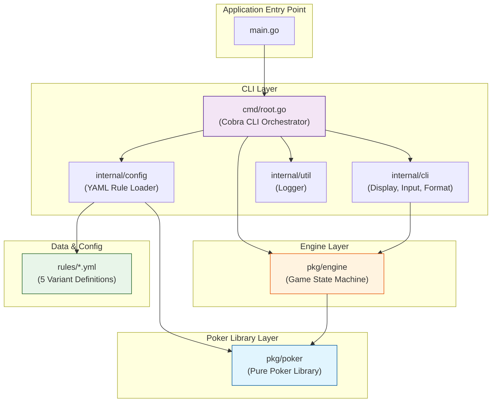
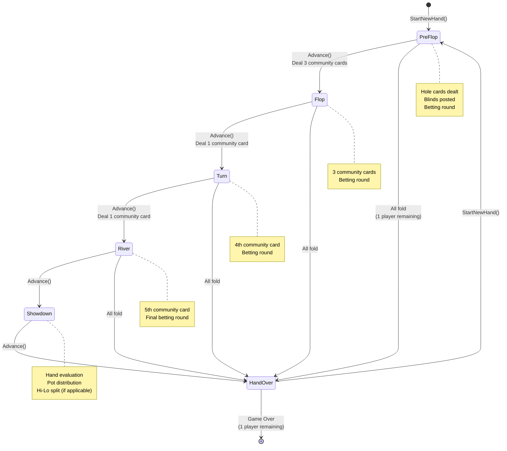
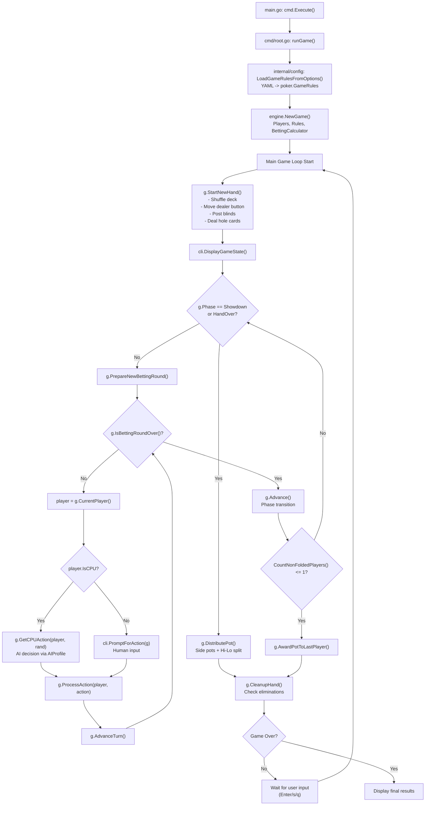
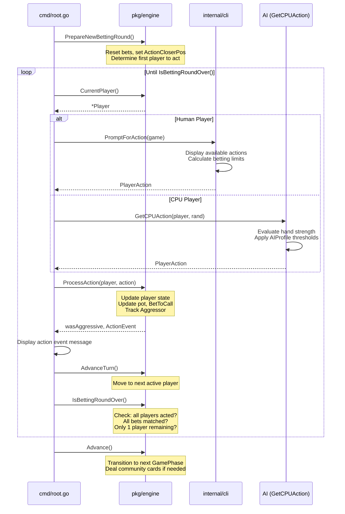
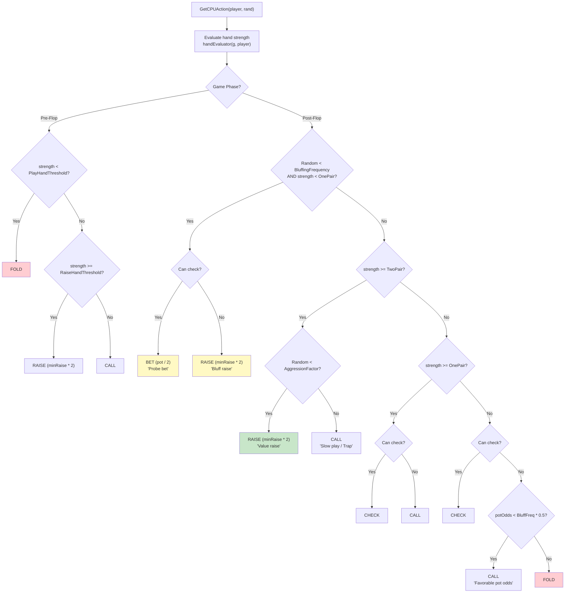
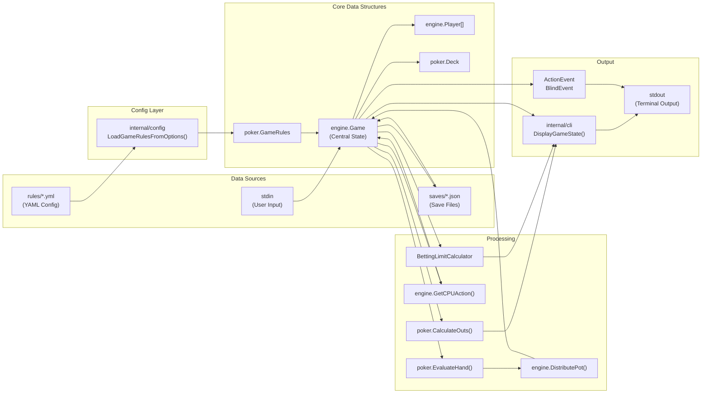
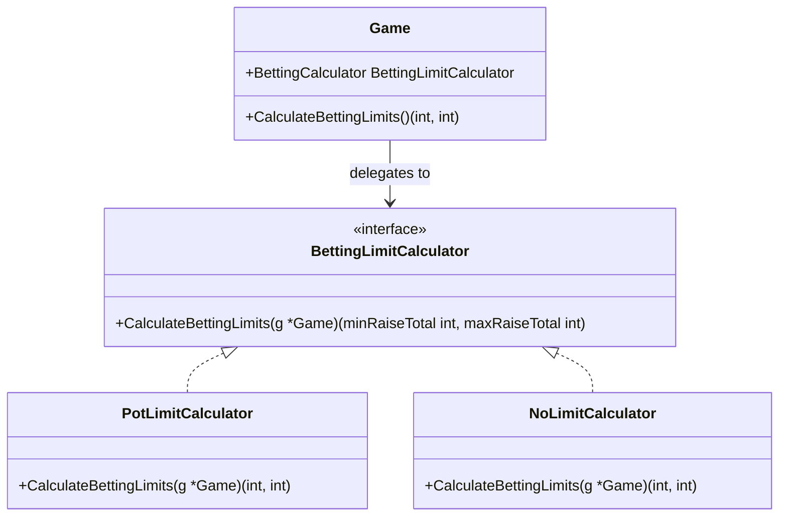
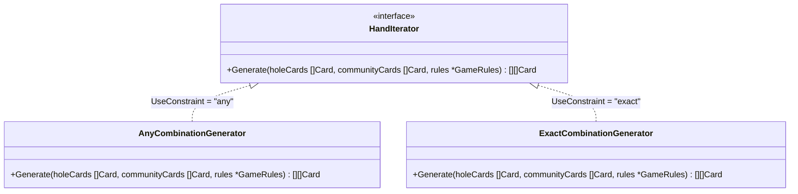
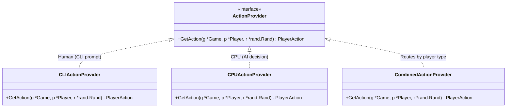
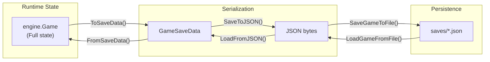

# pls7-cli 애플리케이션 아키텍처

이 문서는 `pls7-cli` 프로젝트의 아키텍처, 핵심 구성 요소, 설계 패턴, 데이터 흐름 및 상호 작용에 대한 포괄적인 기술 문서입니다.

---

## 목차

1. [프로젝트 개요](#프로젝트-개요)
2. [3계층 아키텍처](#3계층-아키텍처)
3. [패키지 의존성 다이어그램](#패키지-의존성-다이어그램)
4. [패키지별 상세 설명](#패키지별-상세-설명)
5. [게임 상태 머신](#게임-상태-머신)
6. [단일 핸드 실행 흐름](#단일-핸드-실행-흐름)
7. [베팅 라운드 시퀀스](#베팅-라운드-시퀀스)
8. [AI 의사결정 시스템](#ai-의사결정-시스템)
9. [데이터 흐름 다이어그램](#데이터-흐름-다이어그램)
10. [핵심 설계 패턴](#핵심-설계-패턴)
11. [지원 변형 비교표](#지원-변형-비교표)
12. [핵심 데이터 구조](#핵심-데이터-구조)
13. [저장/불러오기 시스템](#저장불러오기-시스템)
14. [CLI 인터페이스 및 명령어](#cli-인터페이스-및-명령어)

---

## 프로젝트 개요

`pls7-cli`는 다양한 포커 변형을 지원하는 CLI 기반 포커 게임 엔진입니다. PLS7(Pot-Limit Sampyeong 7-or-Better), PLS, PLO, PLO8, NLH(No-Limit Hold'em) 등 5가지 포커 변형을 지원하며, 난이도 조절이 가능한 AI 상대, 게임 저장/불러오기 기능, 그리고 YAML 파일을 통한 유연한 규칙 설정을 제공합니다.

주요 특징:
- **다변형 지원**: 5가지 포커 변형을 하나의 엔진으로 구동
- **구성 가능한 AI**: 난이도별 4가지 AI 프로파일(TAG, LAG, TAP, LAP)
- **YAML 기반 규칙**: 코드 수정 없이 새로운 포커 변형 추가 가능
- **Hi-Lo 분할 팟**: PLS7, PLO8에서 Hi-Lo 분할 팟 지원
- **커스텀 핸드 랭킹**: Skip Straight, Skip Straight Flush 등 비표준 핸드 지원
- **저장/불러오기**: JSON 기반 게임 상태 직렬화

---

## 3계층 아키텍처

이 애플리케이션은 명확한 관심사 분리 원칙에 따라 3개의 주요 계층으로 설계되었습니다. 의존성 방향은 항상 단방향이며, 상위 계층에서 하위 계층으로만 흐릅니다.

| 계층 | 패키지 | 역할 | 내부 의존성 |
|------|--------|------|------------|
| **CLI 계층** | `cmd`, `internal/cli`, `internal/config` | 사용자 인터페이스, 설정 관리 | Engine, Poker |
| **Engine 계층** | `pkg/engine` | 게임 상태 관리, AI, 팟 분배 | Poker |
| **Poker 계층** | `pkg/poker` | 순수 포커 라이브러리 | 없음 (독립적) |

이 분리된 아키텍처는 핵심 엔진(`pkg/poker`와 `pkg/engine`)의 이식성을 보장합니다. CLI를 Web UI나 GUI로 교체하더라도 하위 계층의 코드는 변경할 필요가 없습니다.

---

## 패키지 의존성 다이어그램

아래 다이어그램은 주요 패키지 간의 의존성 흐름을 시각화합니다.



- **`main.go`**: 프로그램 진입점으로, `cmd.Execute()`를 호출합니다.
- **`cmd`**: Cobra 기반 CLI 오케스트레이터. CLI/설정을 위한 `internal` 패키지와 게임 실행을 위한 `pkg/engine`에 의존합니다.
- **`pkg/engine`**: 게임 흐름을 관리하기 위해 `pkg/poker` 라이브러리를 사용합니다.
- **`internal/config`**: `rules/*.yml` 데이터 파일을 `pkg/poker.GameRules` 구조체로 변환하는 브릿지 역할을 합니다.
- **`pkg/poker`**: 프로젝트 내부 의존성이 전혀 없는 핵심 독립 라이브러리입니다.

---

## 패키지별 상세 설명

### `pkg/poker` -- 순수 포커 라이브러리

외부 의존성이 전혀 없는 독립적인 포커 라이브러리입니다. 카드, 덱, 핸드 평가, 확률 계산 등 포커의 기본 요소를 캡슐화합니다.

| 파일 | 역할 |
|------|------|
| `card.go` | `Card`, `Suit`, `Rank` 타입 정의. 문자열 파싱(`CardsFromStrings`) |
| `deck.go` | `Deck` 구조체. Shuffle, Deal, 디버그용 `DealForDebug`. 결정적 RNG로 저장/불러오기 지원 |
| `combinations.go` | 재귀적 카드 조합 생성기(`combinations` 함수) |
| `evaluation.go` | 핸드 평가 엔진. `HandRank` enum (HighCard ~ RoyalFlush + SkipStraight/SkipStraightFlush). `EvaluateHand`로 High/Low 핸드 동시 평가 |
| `format.go` | `JoinStrings` 유틸리티 |
| `hand_iterator.go` | Strategy Pattern -- `HandIterator` 인터페이스와 두 구현체(`AnyCombinationGenerator`, `ExactCombinationGenerator`) |
| `odds.go` | `OutsInfo` 구조체, `CalculateOuts`(드로우 체크), `CalculateEquity`(Rule of 2 and 4), 팟 오즈 계산 |
| `rules.go` | `GameRules`, `HoleCardRules`, `HandRankingsRules`, `LowHandRules` 구조체 (YAML 태그 포함) |

핵심 설계 원칙:
- **상태 무관(Stateless)**: 게임 상태를 보유하지 않으며, 입력받은 데이터만으로 연산 수행
- **제로 의존성**: 프로젝트 내 다른 패키지를 참조하지 않음
- **`GameRules`가 API 계약**: 어떤 `GameRules` 객체든 동일하게 처리하여 범용성 확보

### `pkg/engine` -- 게임 상태 머신

단일 포커 게임의 상태와 흐름을 관리하는 핵심 엔진입니다. 턴 관리, 베팅 라운드, 팟 분배, AI 의사결정을 담당합니다.

| 파일 | 역할 |
|------|------|
| `action.go` | `ActionType` enum (Fold/Check/Call/Bet/Raise), `PlayerAction` 구조체, `ActionProvider` 인터페이스 |
| `ai.go` | `AIProfile` 기반 의사결정. 4가지 프로파일(TAG/LAG/TAP/LAP). Pre-flop 휴리스틱 + Post-flop 핸드 랭크 평가 |
| `betting_limit.go` | `BettingLimitCalculator` 인터페이스 (Strategy Pattern) -- `PotLimitCalculator`, `NoLimitCalculator` |
| `config.go` | `Difficulty` enum (Easy/Medium/Hard) |
| `event.go` | `ActionEvent`, `BlindEvent` -- UI 통신용 이벤트 구조체 |
| `game.go` | `Game` 구조체(중앙 상태 보관), `GamePhase` enum, `NewGame` 생성자, `CalculateBettingLimits` |
| `player.go` | `Player` 구조체, `PlayerStatus` enum (Playing/Folded/AllIn/Eliminated), `AIProfile` 구조체 |
| `pot.go` | `DistributePot` -- 사이드 팟, Hi-Lo 분할 처리. `DistributionResult`, `PotTier` |
| `run.go` | `ProcessAction`, `StartNewHand`, `Advance`, `PrepareNewBettingRound`, `IsBettingRoundOver`, `CurrentPlayer`, `AdvanceTurn` |
| `save.go` | `GameSaveData` -- JSON 직렬화/역직렬화 |
| `save_manager.go` | `SaveManager` -- 파일 I/O, 목록/검증/삭제 |

### `cmd/root.go` -- Cobra CLI 오케스트레이터

애플리케이션의 진입점으로, 모든 것을 초기화하고 메인 게임 루프를 실행합니다.

주요 구성 요소:
- **`CombinedActionProvider`**: `CLIActionProvider`(사람)와 `CPUActionProvider`(AI)를 플레이어 타입에 따라 라우팅
- **메인 게임 루프**: `StartNewHand` -> `PrepareNewBettingRound` -> 턴 루프 -> `Advance` -> `DistributePot` -> `CleanupHand`
- **CLI 플래그**: `--rule`, `--difficulty`, `--dev`, `--outs`, `--blind-up`, `--initial-chips`, `--small-blind`, `--load`, `--load-file`, `--save-dir`
- **서브커맨드**: `saves list`, `saves validate`, `saves delete`

### `internal/cli` -- 터미널 UI 계층

| 파일 | 역할 |
|------|------|
| `display.go` | `engine.Game` 상태를 콘솔에 렌더링 |
| `input.go` | 플레이어 액션 입력 프롬프트 (`PromptForAction`) |
| `format.go` | `FormatNumber` 등 포맷팅 헬퍼 |

### `internal/config` -- 규칙 로더

| 파일 | 역할 |
|------|------|
| `rules.go` | `LoadGameRulesFromFile`, `LoadGameRulesFromOptions` -- YAML 파일을 `poker.GameRules`로 변환 |

### `rules/*.yml` -- 포커 변형 정의

각 YAML 파일은 하나의 포커 변형을 정의하며, 홀 카드 수, 사용 제약, 베팅 한도, 핸드 랭킹, 로우 핸드 규칙을 포함합니다.

---

## 게임 상태 머신

`GamePhase`는 단일 포커 핸드의 진행 상태를 나타내는 상태 머신입니다. 각 페이즈는 `Game.Advance()` 메서드에 의해 순차적으로 전이됩니다.



각 페이즈에서의 동작:

| 페이즈 | 커뮤니티 카드 | 설명 |
|--------|-------------|------|
| **PreFlop** | 0장 | 홀 카드 분배, 블라인드 포스팅, 첫 번째 베팅 라운드 |
| **Flop** | 3장 | 커뮤니티 카드 3장 공개, 두 번째 베팅 라운드 |
| **Turn** | 4장 | 4번째 커뮤니티 카드 공개, 세 번째 베팅 라운드 |
| **River** | 5장 | 5번째 커뮤니티 카드 공개, 마지막 베팅 라운드 |
| **Showdown** | 5장 | 핸드 평가, 팟 분배 (Hi-Lo 분할 포함) |
| **HandOver** | - | 핸드 정리, 탈락 플레이어 확인, 다음 핸드 준비 |

---

## 단일 핸드 실행 흐름

아래 다이어그램은 하나의 포커 핸드가 시작부터 끝까지 어떻게 처리되는지 보여줍니다.



실행 흐름의 상세 단계:

1. **초기화**: `main`이 `cmd.Execute()`를 호출하고, `runGame` 함수가 트리거됩니다.
2. **규칙 로딩**: `internal/config`를 사용하여 선택된 `.yml` 파일을 `poker.GameRules` 구조체로 로드합니다.
3. **게임 생성**: `engine.NewGame()`이 플레이어, 칩, 규칙, `BettingLimitCalculator`를 설정합니다.
4. **핸드 시작**: `g.StartNewHand()`가 덱을 섞고, 딜러 버튼을 이동하고, 블라인드를 포스팅하고, 홀 카드를 분배합니다.
5. **베팅 라운드**: 각 페이즈에서 `PrepareNewBettingRound()` -> `IsBettingRoundOver()` 루프를 통해 턴별로 액션을 처리합니다.
6. **페이즈 전이**: 베팅 라운드가 끝나면 `g.Advance()`가 다음 페이즈로 전이하며 커뮤니티 카드를 공개합니다.
7. **쇼다운/결론**: 모든 베팅 라운드 종료 후 `g.DistributePot()`이 승자를 결정하고 칩을 분배합니다.
8. **정리**: `g.CleanupHand()`가 탈락 플레이어를 확인하고, 다음 핸드를 시작하거나 게임을 종료합니다.

---

## 베팅 라운드 시퀀스

아래 시퀀스 다이어그램은 하나의 베팅 라운드에서 각 컴포넌트 간의 상호작용을 보여줍니다.



### 베팅 라운드 종료 조건

`IsBettingRoundOver()`는 다음 조건 중 하나라도 충족되면 `true`를 반환합니다:

1. **폴드하지 않은 플레이어가 1명 이하**: 한 명을 제외한 모든 플레이어가 폴드
2. **모든 활성 플레이어가 액션을 수행**: `ActionsTakenThisRound >= CountPlayersAbleToAct()`
3. **모든 플레이어의 베팅이 일치**: `Playing` 상태인 모든 플레이어의 `CurrentBet >= BetToCall`

---

## AI 의사결정 시스템

CPU 플레이어는 `AIProfile` 기반으로 의사결정을 수행합니다. Pre-flop과 Post-flop 단계에서 서로 다른 평가 전략을 사용합니다.

### AI 프로파일

| 프로파일 | PlayHandThreshold | RaiseHandThreshold | BluffingFrequency | AggressionFactor | 설명 |
|---------|------------------|--------------------|-------------------|------------------|------|
| **Tight-Aggressive (TAG)** | 20 | 25 | 0.15 | 0.7 | 적은 핸드를 플레이하지만, 플레이할 때는 공격적 |
| **Loose-Aggressive (LAG)** | 10 | 20 | 0.35 | 0.9 | 많은 핸드를 플레이하며 매우 공격적 |
| **Tight-Passive (TAP)** | 22 | 28 | 0.05 | 0.3 | 매우 선택적이며, 콜을 선호 |
| **Loose-Passive (LAP)** | 8 | 24 | 0.10 | 0.2 | 많은 핸드를 콜하지만, 레이즈는 거의 안 함 |

### 난이도별 AI 프로파일 배정

| 난이도 | CPU 1 | CPU 2 | CPU 3 | CPU 4 | CPU 5 |
|--------|-------|-------|-------|-------|-------|
| **Easy** | LAP | LAP | LAP | LAP | LAP |
| **Medium** | LAP | LAP | TAP | TAP | TAP |
| **Hard** | TAP | LAG | LAG | TAG | TAG |

### AI 의사결정 플로우차트



### Pre-flop 핸드 강도 평가

Pre-flop에서는 `evaluateHandStrength` 함수가 커스텀 휴리스틱을 사용하여 홀 카드의 잠재력을 점수로 환산합니다:

| 평가 요소 | 점수 |
|-----------|------|
| **하이 카드** (10 이상) | A=10, K=8, Q=7, J=6, 10=5 |
| **포켓 페어** | 15 + 페어 랭크 값 |
| **수티드 카드** | +2 |
| **커넥터** (2장 연속) | +2 |
| **3장 스트레이트** (3장 연속) | +5 |
| **하이 클로즈** (10 이상, 갭 < 5) | +1 |

Post-flop에서는 실제 5장 핸드의 `HandRank` 값을 그대로 사용합니다.

---

## 데이터 흐름 다이어그램

아래 다이어그램은 애플리케이션 전반의 데이터 흐름을 보여줍니다.



### 주요 데이터 흐름 경로

1. **규칙 로딩 경로**: `rules/*.yml` -> `internal/config` -> `poker.GameRules` -> `engine.Game`
2. **사용자 입력 경로**: `stdin` -> `internal/cli.PromptForAction()` -> `engine.ProcessAction()` -> `engine.Game` 상태 업데이트
3. **AI 의사결정 경로**: `engine.Game` -> `evaluateHandStrength()` -> `AIProfile` 판단 -> `PlayerAction` -> `engine.ProcessAction()`
4. **출력 경로**: `engine.Game` -> `internal/cli.DisplayGameState()` -> `stdout`
5. **저장/불러오기 경로**: `engine.Game` <-> `GameSaveData` <-> `saves/*.json`

---

## 핵심 설계 패턴

### 1. Strategy Pattern -- `BettingLimitCalculator`

베팅 한도 계산을 인터페이스로 추상화하여, 게임 변형에 따라 적절한 계산기를 주입합니다. 이를 통해 `Game` 구조체가 각 규칙 유형에 대한 `if/else` 문 없이 베팅 한도를 계산할 수 있습니다.



- **`PotLimitCalculator`**: 최대 레이즈 = 콜 후 팟 크기. PLS7, PLS, PLO, PLO8에서 사용.
- **`NoLimitCalculator`**: 최대 레이즈 = 플레이어 전체 칩 스택(올인). NLH에서 사용.
- `Game.NewGame()` 생성자에서 `rules.BettingLimit` 값에 따라 적절한 구현체를 선택합니다.

### 2. Strategy Pattern -- `HandIterator`

핸드 조합 생성을 인터페이스로 추상화하여, 포커 변형의 홀 카드 사용 규칙에 따라 다른 조합 생성 전략을 적용합니다.



- **`AnyCombinationGenerator`**: 홀 카드와 커뮤니티 카드를 합친 풀에서 최적의 5장 조합을 생성. NLH, PLS7, PLS에서 사용 (`use_constraint: "any"`).
- **`ExactCombinationGenerator`**: 홀 카드에서 정확히 N장, 커뮤니티 카드에서 나머지를 사용하는 조합 생성. PLO, PLO8에서 사용 (`use_constraint: "exact"`, `use_count: 2`).
- `evaluation.go`의 `getHandIterator()` 함수가 `GameRules.HoleCards.UseConstraint` 값에 따라 적절한 구현체를 선택합니다.

### 3. Interface Pattern -- `ActionProvider`

플레이어 입력 소스를 인터페이스로 추상화하여, 게임 엔진이 입력 소스에 독립적으로 동작합니다.



- **`CLIActionProvider`**: `cli.PromptForAction()`을 호출하여 사람 플레이어로부터 입력을 받습니다.
- **`CPUActionProvider`**: `g.GetCPUAction()`을 호출하여 AI 의사결정을 수행합니다.
- **`CombinedActionProvider`**: `player.IsCPU` 여부에 따라 적절한 제공자로 라우팅합니다. `cmd/root.go`의 메인 게임 루프에서 사용됩니다.

이 설계를 통해 향후 네트워크 클라이언트나 GUI 인터페이스를 추가할 때, 새로운 `ActionProvider` 구현체만 작성하면 됩니다.

---

## 지원 변형 비교표

| 속성 | PLS7 | PLS | NLH | PLO | PLO8 |
|------|------|-----|-----|-----|------|
| **정식 명칭** | Pot-Limit Sampyeong 7-or-Better | Pot-Limit Sampyeong | No-Limit Texas Hold'em | Pot-Limit Omaha | Pot-Limit Omaha 8-or-Better |
| **홀 카드 수** | 3 | 3 | 2 | 4 | 4 |
| **사용 제약** | any | any | any | exact 2 | exact 2 |
| **베팅 한도** | Pot-Limit | Pot-Limit | No-Limit | Pot-Limit | Pot-Limit |
| **표준 랭킹** | 커스텀 | 커스텀 | 표준 | 표준 | 표준 |
| **Skip Straight** | 지원 | 지원 | - | - | - |
| **Skip Straight Flush** | 지원 | 지원 | - | - | - |
| **로우 핸드** | 7-or-Better | - | - | - | 8-or-Better |
| **Hi-Lo 분할** | 지원 | - | - | - | 지원 |
| **YAML 파일** | `rules/pls7.yml` | `rules/pls.yml` | `rules/nlh.yml` | `rules/plo.yml` | `rules/plo8.yml` |

### 커스텀 핸드 랭킹 순서 (PLS7, PLS)

PLS7과 PLS는 표준 포커 랭킹에 Skip Straight와 Skip Straight Flush를 추가한 커스텀 랭킹을 사용합니다:

| 순위 | 핸드 | 설명 |
|------|------|------|
| 1 | Royal Flush | A-K-Q-J-10 동일 수트 |
| 2 | **Skip Straight Flush** | Skip Straight + 동일 수트 (예: K-J-9-7-5 동일 수트) |
| 3 | Straight Flush | 5장 연속 + 동일 수트 |
| 4 | Four of a Kind | 동일 랭크 4장 |
| 5 | Full House | Three of a Kind + One Pair |
| 6 | Flush | 동일 수트 5장 |
| 7 | **Skip Straight** | 한 칸씩 건너뛴 5장 연속 (예: K-J-9-7-5) |
| 8 | Straight | 5장 연속 |
| 9 | Three of a Kind | 동일 랭크 3장 |
| 10 | Two Pair | 두 쌍 |
| 11 | One Pair | 한 쌍 |
| 12 | High Card | 가장 높은 카드 |

---

## 핵심 데이터 구조

### `poker.GameRules` -- 게임 규칙 청사진

YAML에서 로드된 게임 변형의 완전한 규칙 정의입니다. 이 구조체가 엔진의 동작을 결정하는 "API 계약" 역할을 합니다.

```
GameRules
├── Name: string             ("Pot-Limit Sampyeong 7-or-Better")
├── Abbreviation: string     ("PLS7")
├── BettingLimit: string     ("pot_limit" | "no_limit")
├── HoleCards: HoleCardRules
│   ├── Count: int           (2, 3, or 4)
│   ├── UseConstraint: string ("any" | "exact")
│   └── UseCount: int        (0 or 2)
├── HandRankings: HandRankingsRules
│   ├── UseStandardRankings: bool
│   └── CustomRankings: []CustomHandRanking
│       ├── Name: string
│       └── InsertAfterRank: string
└── LowHand: LowHandRules
    ├── Enabled: bool
    └── MaxRank: int          (0, 7, or 8)
```

### `engine.Game` -- 중앙 게임 상태

애플리케이션의 핵심이며, 포커 핸드의 전체 상태를 캡슐화합니다.

```
Game
├── Players: []*Player            (모든 참가자)
├── Deck: *poker.Deck             (현재 핸드의 덱)
├── CommunityCards: []poker.Card  (공유 카드)
├── Pot: int                      (현재 팟)
├── Phase: GamePhase              (현재 페이즈)
├── DealerPos: int                (딜러 버튼 위치)
├── CurrentTurnPos: int           (현재 턴 플레이어 위치)
├── BetToCall: int                (콜해야 하는 금액)
├── LastRaiseAmount: int          (최근 레이즈 크기)
├── Aggressor: *Player            (마지막 공격적 액션 수행자)
├── ActionCloserPos: int          (액션 종료 위치)
├── ActionsTakenThisRound: int    (현재 라운드 액션 수)
├── Rules: *poker.GameRules       (게임 규칙)
├── BettingCalculator: BettingLimitCalculator (베팅 한도 계산기)
├── SmallBlind / BigBlind: int    (블라인드 크기)
├── BlindUpInterval: int          (블라인드 인상 간격)
├── Difficulty: Difficulty        (AI 난이도)
├── HandCount: int                (누적 핸드 수)
├── Rand: *rand.Rand              (난수 생성기)
├── handEvaluator: func           (핸드 강도 평가 함수, 테스트용 주입 가능)
├── DevMode: bool                 (개발 모드)
├── ShowsOuts: bool               (아웃 표시 여부)
└── TotalInitialChips: int        (전체 초기 칩 합계, 무결성 검증용)
```

### `engine.Player` -- 플레이어 상태

```
Player
├── Name: string              (플레이어 이름)
├── Hand: []poker.Card        (홀 카드)
├── Chips: int                (보유 칩)
├── CurrentBet: int           (현재 라운드 베팅 금액)
├── TotalBetInHand: int       (핸드 전체 누적 베팅)
├── Status: PlayerStatus      (Playing/Folded/AllIn/Eliminated)
├── IsCPU: bool               (CPU 여부)
├── Profile: *AIProfile       (AI 프로파일, CPU만 해당)
├── Position: int             (테이블 좌석 번호)
└── LastActionDesc: string    (마지막 액션 설명)
```

---

## 저장/불러오기 시스템

게임 상태는 JSON 형식으로 직렬화되어 파일 시스템에 저장됩니다. 저장 데이터는 새 핸드를 시작하는 데 필요한 최소한의 정보만 포함합니다.



### `GameSaveData` 구조

```
GameSaveData
├── Timestamp: time.Time
├── GameMetadata
│   ├── HandCount, DealerPos
│   ├── SmallBlind, BigBlind
│   ├── BlindUpInterval
│   └── TotalInitialChips
├── Players: []PlayerSaveData
│   ├── Name, Chips, IsCPU, Position, Status
│   └── Profile: *AIProfileSaveData (optional)
├── GameRules: poker.GameRules
└── Settings
    ├── Difficulty
    ├── DevMode
    └── ShowsOuts
```

저장 시스템은 `SaveManager`를 통해 파일 I/O를 관리하며, 다음 기능을 제공합니다:
- **저장**: `SaveGameToFile()` -- 자동 타임스탬프 파일명 생성
- **불러오기**: `LoadGameFromFile()` -- 특정 파일 또는 최근 저장 파일 로드
- **목록**: `ListSaveFiles()` -- 저장된 게임 목록 조회
- **검증**: `ValidateSaveFile()` -- 저장 파일 유효성 검사
- **삭제**: `DeleteSaveFile()` -- 저장 파일 삭제

---

## CLI 인터페이스 및 명령어

### 메인 게임 실행

```bash
go run main.go                           # 기본값: PLS7, Medium 난이도
go run main.go -r nlh -d easy            # NLH 변형, Easy 난이도
go run main.go -r plo8 -d hard           # PLO8 변형, Hard 난이도
go run main.go --initial-chips 500000    # 초기 칩 50만
go run main.go --small-blind 1000        # 스몰 블라인드 1000
go run main.go --blind-up 5             # 5핸드마다 블라인드 인상
go run main.go --dev                     # 개발 모드 (디버그 핸드 + 상세 로그)
go run main.go --outs                    # 아웃 카드 표시
go run main.go --load                    # 최근 저장 게임 불러오기
go run main.go --load-file save_20250101 # 특정 파일 불러오기
```

### 저장 게임 관리

```bash
go run main.go saves list                # 저장된 게임 목록 조회
go run main.go saves validate <filename> # 저장 파일 유효성 검사
go run main.go saves delete <filename>   # 저장 파일 삭제
```

### CLI 플래그 정리

| 플래그 | 축약 | 기본값 | 설명 |
|--------|------|--------|------|
| `--rule` | `-r` | `pls7` | 게임 변형 (pls7, pls, nlh, plo, plo8) |
| `--difficulty` | `-d` | `medium` | AI 난이도 (easy, medium, hard) |
| `--dev` | - | `false` | 개발 모드 (상세 로그, 디버그 핸드) |
| `--outs` | - | `false` | 아웃 카드 표시 |
| `--blind-up` | - | `2` | 블라인드 인상 간격 (0 = 비활성) |
| `--initial-chips` | - | `300000` | 초기 칩 |
| `--small-blind` | - | `500` | 스몰 블라인드 |
| `--load` | `-l` | `false` | 저장 게임 불러오기 |
| `--load-file` | - | `""` | 특정 저장 파일 불러오기 |
| `--save-dir` | - | `saves` | 저장 디렉토리 경로 |
