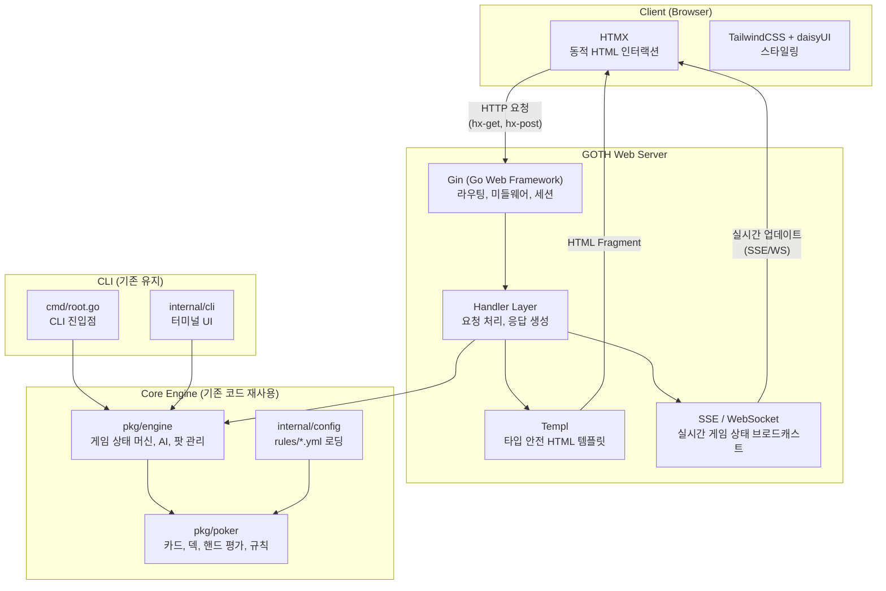

# 개발 로드맵 (2026-02-11 기준)

이 로드맵은 이전 로드맵(roadmap_v20250827.md)을 대체하며, pls7-cli 프로젝트의 향후 개발 방향과 우선순위를 재정의합니다.

---

## 이전 로드맵 대비 변경 사항

### 완료 항목

이전 로드맵의 1단계(CLI 애플리케이션 강화)는 모두 완료되었습니다.

- 최초 칩/블라인드 설정 기능 -- 완료
- 게임 상태 저장 및 불러오기(JSON 직렬화) -- 완료

### 우선순위 변경

| 항목 | 이전 로드맵 | 새 로드맵 | 변경 사유 |
|------|------------|-----------|-----------|
| CLI 강화 (칩/블라인드, 저장/불러오기) | 1단계 | 완료 | 이미 구현 완료 |
| 웹 애플리케이션 구축 | 3~4단계 | **1~2단계** | 최우선 과제로 격상 |
| 실시간 멀티플레이어 (웹) | 5단계 | **3단계** | 웹 기반으로 통합 |
| 서비스 고도화 | 5단계 | **4단계** | 웹 애플리케이션 완성 후 진행 |
| CLI 멀티플레이어 (TCP) | 2단계 | **5단계 (선택)** | 웹 우선 전략으로 후순위 |
| 기술 스택 | HTTP API + Vue.js (SPA) | **GOTH Stack (SSR)** | 아래 상세 설명 참조 |

### 기술 스택 변경 이유

이전 로드맵에서는 백엔드(HTTP API 서버)와 프론트엔드(Vue.js SPA)를 분리하여 개발하는 방식을 계획했습니다. 새 로드맵에서는 **GOTH Stack 기반의 SSR(Server-Side Rendering) 방식**으로 전환합니다.

**변경 근거:**

1. **개발 복잡도 감소**: 별도의 프론트엔드 빌드 파이프라인(Node.js, npm, webpack/vite)이 필요 없습니다. Go 단일 언어로 전체 애플리케이션을 개발할 수 있습니다.
2. **기존 역량 극대화**: 프로젝트의 핵심 역량은 Go 기반 포커 엔진입니다. GOTH Stack은 Go 생태계 안에서 웹 애플리케이션을 완성할 수 있어 기존 코드베이스와의 통합이 자연스럽습니다.
3. **JavaScript 프레임워크 불필요**: HTMX를 통해 페이지 전체를 새로고침하지 않는 동적 인터랙션을 HTML 속성만으로 구현할 수 있습니다. 복잡한 상태 관리 라이브러리(Pinia, Vuex)가 필요 없습니다.
4. **배포 단순화**: 단일 Go 바이너리로 컴파일되므로 배포가 간단합니다. Docker 이미지 크기도 최소화됩니다.
5. **실시간 통신 통합**: HTMX의 SSE(Server-Sent Events) 확장 또는 WebSocket을 통해 실시간 게임 상태 업데이트를 같은 스택 안에서 처리할 수 있습니다.

---

## GOTH Stack 아키텍처

### 기술 스택 구성

| 구성 요소 | 기술 | 역할 |
|-----------|------|------|
| **G** | Go + Gin | 웹 서버 및 라우팅, API 핸들러 |
| **O** | (연결 레이어) | Gin과 Templ을 연결하는 핸들러 계층 |
| **T** | Templ | 타입 안전한 Go HTML 템플릿 엔진 |
| **H** | HTMX | JavaScript 없이 동적 HTML 인터랙션 |
| +a | TailwindCSS + daisyUI | 유틸리티 기반 CSS 스타일링 및 컴포넌트 |
| +a | Air | 개발 환경 Hot-Reload |

### 아키텍처 다이어그램

### 핵심 설계 원칙

기존 3계층 아키텍처(CLI -> Engine -> Poker Library)의 장점을 그대로 유지합니다. `pkg/poker`와 `pkg/engine`은 UI에 독립적이므로, 새로운 웹 계층을 CLI와 병렬로 추가하기만 하면 됩니다. 기존 엔진 코드를 수정할 필요가 없습니다.

---

## Stage 1: 웹 애플리케이션 기반 구축 (GOTH Stack)

### 목표

GOTH Stack을 도입하여 웹 애플리케이션의 기술적 토대를 마련합니다. 이 단계가 끝나면 기본적인 페이지 라우팅과 레이아웃이 동작하며, 개발 환경이 갖춰진 상태가 됩니다.

### 주요 작업

1. **프로젝트 구조 설정**
   - `web/` 디렉터리 추가: 핸들러(`web/handler/`), Templ 템플릿(`web/template/`), 정적 파일(`web/static/`) 구성
   - `cmd/` 하위에 웹 서버 진입점 추가 (기존 CLI 진입점과 병렬)
   - Go 모듈 의존성 추가: `gin-gonic/gin`, `a-h/templ`

2. **Gin 웹 서버 구성**
   - 기본 라우팅 설정 (홈, 게임 로비, 게임 테이블 등)
   - 미들웨어 구성: 로깅, 에러 핸들링, 정적 파일 서빙
   - `pkg/engine` 및 `internal/config`와의 연동 확인

3. **Templ 템플릿 통합**
   - Templ CLI 설치 및 코드 생성 파이프라인 구축
   - 기본 레이아웃 템플릿 작성 (header, footer, navigation)
   - Templ의 타입 안전 특성을 활용한 컴포넌트 설계 방식 수립

4. **TailwindCSS + daisyUI 설정**
   - TailwindCSS standalone CLI 또는 최소한의 Node.js 설정으로 빌드 구성
   - daisyUI 테마 설정 (포커 게임에 적합한 다크 테마)
   - 기본 UI 컴포넌트 스타일 정의: 버튼, 카드, 테이블, 모달

5. **개발 환경 구성**
   - Air 설정으로 Go 코드 및 Templ 파일 변경 시 자동 리빌드
   - Makefile 또는 Taskfile에 개발/빌드 명령어 통합
   - `.air.toml` 설정 파일 구성

6. **CI/CD 파이프라인 강화**
   - `go test -race ./...` 경쟁 상태 검출 테스트 추가
   - Templ 코드 생성 단계를 CI에 포함
   - Docker 멀티 스테이지 빌드 설정 (빌드 이미지 -> 최소 실행 이미지)

### 기술 결정 사항

- **Gin 선택 이유**: Go 웹 프레임워크 중 가장 넓은 커뮤니티와 풍부한 미들웨어 생태계 보유. 성능 우수.
- **Templ 선택 이유**: Go의 기본 `html/template`보다 타입 안전성이 뛰어나고, IDE 지원(자동완성, 에러 검출)이 좋음. 컴파일 타임에 템플릿 오류 검출 가능.
- **TailwindCSS + daisyUI 선택 이유**: 유틸리티 클래스 기반으로 빠른 UI 프로토타이핑 가능. daisyUI는 사전 정의된 컴포넌트를 제공하여 디자인 일관성 확보.

---

## Stage 2: 핵심 웹 게임 구현

### 목표

웹 브라우저에서 AI 상대로 포커 게임을 플레이할 수 있는 완전한 싱글 플레이어 경험을 구현합니다.

### 주요 작업

1. **게임 로비 구현**
   - 게임 룰 선택 UI (PLS7, PLS, PLO, PLO8, NLH) -- `rules/*.yml` 기반
   - AI 난이도 선택 (Easy, Medium, Hard)
   - 초기 칩/블라인드 설정 입력 폼
   - "게임 시작" 버튼으로 새 게임 생성

2. **게임 테이블 UI (Templ 컴포넌트)**
   - 플레이어 포지션 배치 (카드, 칩, 상태 표시)
   - 커뮤니티 카드 보드
   - 팟 표시 및 사이드 팟 시각화
   - 카드 디자인 (숫자, 슈트별 색상 구분)
   - 현재 딜러/블라인드 포지션 표시

3. **HTMX 기반 게임 인터랙션**
   - 베팅 액션 버튼 (Fold, Check, Call, Raise/Bet) -- `hx-post`로 서버에 액션 전송
   - 액션 후 게임 테이블 영역 부분 업데이트 -- `hx-swap`으로 HTML fragment 교체
   - 베팅 금액 입력 (슬라이더 또는 입력 필드)
   - 게임 페이즈 전환 시 커뮤니티 카드 업데이트
   - 쇼다운 결과 표시

4. **게임 상태 관리**
   - 서버 측 게임 세션 관리 (in-memory, 게임 ID 기반)
   - Cookie 기반 세션으로 사용자와 게임 연결
   - 기존 `engine.Game` 인스턴스를 세션별로 유지
   - 게임 저장/불러오기 기능의 웹 연동

5. **AI 턴 처리**
   - AI 액션을 서버에서 자동 처리 후 결과 반환
   - AI 사고 시간 시뮬레이션 (자연스러운 게임 흐름을 위한 지연)
   - AI 액션 결과를 HTMX 응답으로 클라이언트에 반영

### 기술 결정 사항

- **세션 관리**: 이 단계에서는 in-memory 세션 저장소를 사용합니다. 싱글 서버 환경에서 충분하며, 이후 단계에서 Redis 등으로 확장 가능합니다.
- **HTMX 패턴**: OOB(Out-of-Band) swap을 활용하여 단일 HTTP 응답으로 여러 DOM 영역을 동시에 업데이트합니다 (예: 게임 테이블 + 팟 표시 + 플레이어 칩).

---

## Stage 3: 실시간 멀티플레이어 웹 게임

### 목표

여러 플레이어가 웹 브라우저를 통해 같은 게임 테이블에서 실시간으로 포커를 즐길 수 있도록 합니다.

### 주요 작업

1. **실시간 통신 계층 구축**
   - HTMX SSE Extension 또는 WebSocket 핸들러 구현
   - 게임 상태 변경 시 연결된 모든 클라이언트에 업데이트 브로드캐스트
   - 연결 관리: 접속, 재접속, 타임아웃 처리

2. **멀티플레이어 게임 룸**
   - 게임 룸 생성/참가/나가기 기능
   - 룸 내 플레이어 목록 및 준비 상태 관리
   - 관전자 모드: 진행 중인 게임을 실시간으로 관전
   - 룸별 채팅 기능 (선택)

3. **플레이어 인증 (OAuth2)**
   - Google, GitHub OAuth2 로그인 구현
   - `golang.org/x/oauth2` 패키지 활용
   - 인증 후 세션 관리 (JWT 또는 서버 측 세션)
   - 게스트 플레이 옵션 (비로그인 사용자 지원)

4. **게임 상태 동기화**
   - 각 플레이어에게 자신의 카드만 공개하는 상태 필터링
   - 턴 타이머: 일정 시간 내 액션이 없으면 자동 Fold
   - 네트워크 지연 처리 및 상태 일관성 보장
   - 게임 중 플레이어 이탈 처리 (자동 Fold, AI 대체 등)

### 기술 결정 사항

- **SSE vs WebSocket**: 포커 게임은 서버에서 클라이언트로의 단방향 업데이트가 주를 이루므로 SSE가 더 적합할 수 있습니다. 클라이언트의 액션은 일반 HTTP POST로 처리합니다. 다만, 채팅 등 양방향 통신이 필요하면 WebSocket을 병행합니다.
- **인증 시점**: OAuth2 인증은 멀티플레이어 단계에서 도입합니다. 싱글 플레이어(Stage 2)에서는 인증 없이 바로 게임을 시작할 수 있어야 합니다.

---

## Stage 4: 서비스 고도화

### 목표

게임 경험을 풍부하게 하고, 서비스의 완성도를 높이는 부가 기능들을 구현합니다.

### 주요 작업

1. **게임 룰 관리 웹 UI**
   - `rules/*.yml`에 정의된 게임 규칙을 웹 UI에서 조회
   - 커스텀 룰 생성 및 수정 기능 (관리자 전용)
   - 룰 설정 변경의 실시간 미리보기

2. **게임 히스토리 및 통계**
   - 핸드 히스토리 기록 및 리플레이 기능
   - 플레이어 통계: 승률, 수익, 플레이 스타일 분석
   - 게임별/기간별 통계 대시보드

3. **플레이어 프로필 및 리더보드**
   - 사용자 프로필 페이지 (전적, 칩 보유량)
   - 리더보드: 전체 랭킹, 변종별 랭킹
   - 업적 시스템 (선택)

4. **모바일 반응형 디자인**
   - TailwindCSS의 반응형 유틸리티를 활용한 모바일 최적화
   - 터치 인터페이스 최적화 (베팅 슬라이더, 카드 터치 등)
   - 모바일 환경에서의 게임 테이블 레이아웃 재구성

5. **데이터 영속성**
   - SQLite 또는 PostgreSQL 도입으로 게임 데이터 영속 저장
   - 사용자 정보, 게임 기록, 통계 데이터 저장
   - 데이터베이스 마이그레이션 관리

### 기술 결정 사항

- **데이터베이스 선택**: 초기에는 SQLite로 시작하여 배포를 단순화하고, 트래픽이 증가하면 PostgreSQL로 마이그레이션합니다.
- **통계 처리**: 실시간 집계보다는 게임 종료 시점에 배치 방식으로 통계를 업데이트하여 게임 성능에 영향을 주지 않도록 합니다.

---

## Stage 5: CLI 멀티플레이어 (향후 과제 / 선택)

### 목표

터미널 환경에서 여러 사용자가 TCP 소켓을 통해 실시간 포커를 플레이할 수 있도록 합니다. 이 단계는 웹 기반 멀티플레이어가 안정화된 이후 필요에 따라 진행합니다.

### 주요 작업

1. **TCP 기반 게임 서버**
   - `net` 패키지를 사용한 TCP 서버 구현
   - 각 클라이언트 연결을 Goroutine으로 처리
   - 게임 상태를 중앙에서 관리하는 서버 로직

2. **CLI 클라이언트 수정**
   - `--join <ip:port>` 플래그 추가로 클라이언트 모드 동작
   - 서버로부터 수신한 게임 상태를 터미널에 렌더링
   - 자신의 턴에 입력을 서버로 전송

3. **통신 프로토콜 정의**
   - JSON 기반 텍스트 프로토콜 설계
   - 서버 -> 클라이언트: `{"type": "gameState", "data": ...}`
   - 클라이언트 -> 서버: `{"type": "playerAction", "action": "bet", "amount": 100}`

### 참고 사항

- 웹 멀티플레이어(Stage 3)의 게임 동기화 로직을 최대한 재사용합니다.
- 웹 서버와 TCP 서버가 동일한 `pkg/engine` 인스턴스를 공유하는 구조를 고려합니다.

---

## 현재 프로젝트 상태 요약

| 항목 | 상태 |
|------|------|
| 지원 포커 변종 | PLS7, PLS, PLO, PLO8, NLH (5종) |
| AI 프로필 | TAG, LAG, TAP, LAP (4종) |
| AI 난이도 | Easy, Medium, Hard (3단계) |
| 저장/불러오기 | JSON 직렬화 기반 구현 완료 |
| 아키텍처 | CLI -> Engine -> Poker Library (3계층) |
| 엔진 이식성 | `pkg/poker` + `pkg/engine`은 UI 독립적, 웹 계층 추가 가능 |
| CI/CD | GitHub Actions (`go build`, `go test`), Go 1.23 |

---

## 일정 가이드 (참고용)

아래 일정은 예상치이며, 실제 개발 속도와 참여 인원에 따라 조정될 수 있습니다.

| 단계 | 예상 기간 | 비고 |
|------|-----------|------|
| Stage 1: 웹 기반 구축 | 3-4주 | GOTH Stack 학습 곡선 포함 |
| Stage 2: 핵심 웹 게임 | 4-6주 | UI 디자인 및 게임 흐름 구현 |
| Stage 3: 실시간 멀티플레이어 | 4-6주 | 실시간 동기화가 핵심 난이도 |
| Stage 4: 서비스 고도화 | 4-6주 | 기능별 독립 개발 가능 |
| Stage 5: CLI 멀티플레이어 | 2-3주 | 선택 사항, 필요 시 진행 |
