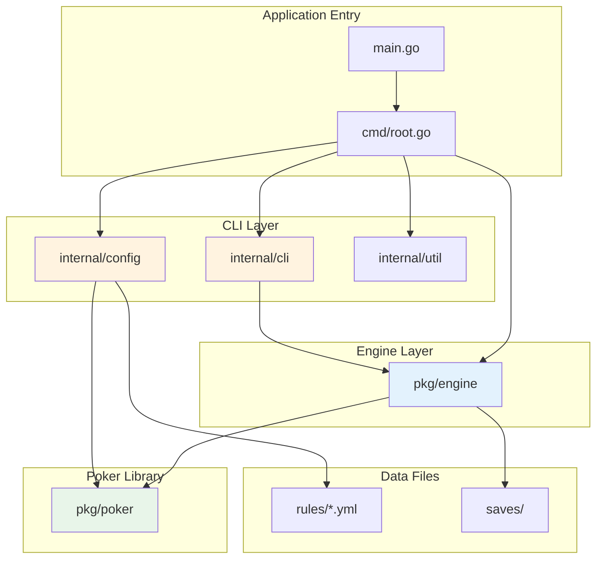

# Directory Structure

This document provides a comprehensive map of the `pls7-cli` project directory structure. Every directory and file is listed with its purpose and responsibilities.

## Three-Layer Architecture

The project follows a strict three-layer dependency direction:

```
CLI Layer (cmd, internal) --> Engine Layer (pkg/engine) --> Poker Library (pkg/poker)
```

Each layer only depends on the layer below it, never the reverse. This separation of concerns makes the core engine portable and the UI replaceable.

## Dependency Diagram



## Full Directory Tree

```
pls7-cli/
├── .claude/                        # Claude Code configuration
│   ├── settings.json               # Claude Code project settings
│   └── skills/                     # Project-specific Claude Code skills
│       ├── pls7-commit/            # Conventional commit message generation
│       ├── pls7-dev-rules/         # Development rules (TDD, logging, conventions)
│       ├── pls7-pr-message/        # PR title and description generation
│       └── pls7-work-log/          # Session work log generation
├── .github/
│   └── workflows/
│       └── go.yml                  # CI pipeline: build + test on Go 1.23
├── cmd/
│   └── root.go                     # Cobra CLI entry point, main game loop, CombinedActionProvider
├── docs/
│   ├── images/
│   │   └── pls7-cli-architecture-diagram.png  # Architecture diagram image
│   ├── issue-history/              # Session work logs (YYYYMMDD_topic.md format)
│   ├── architecture.md             # Architecture documentation (English)
│   ├── architecture_ko.md          # Architecture documentation (Korean)
│   ├── directory_structure.md      # This file (English)
│   ├── directory_structure_ko.md   # This file (Korean)
│   ├── roadmap_v20250827.md        # Original project roadmap
│   └── roadmap_v20260211.md        # Updated project roadmap
├── internal/
│   ├── cli/
│   │   ├── display.go              # Game state rendering to terminal
│   │   ├── format.go               # Number formatting (FormatNumber with comma separators)
│   │   └── input.go                # Player action prompts and input validation
│   ├── config/
│   │   ├── rules.go                # YAML rule file loading into poker.GameRules
│   │   └── rules_test.go           # Tests for rule loading
│   └── util/
│       └── logger.go               # Logrus logger initialization (dev/prod modes)
├── pkg/
│   ├── poker/                      # Pure poker library (zero internal dependencies)
│   │   ├── card.go                 # Card, Suit, Rank types
│   │   ├── deck.go                 # Deck operations (shuffle, deal, deterministic RNG)
│   │   ├── deck_test.go            # Tests for deck operations
│   │   ├── combinations.go         # Card combination generator
│   │   ├── combinations_test.go    # Tests for combination generation
│   │   ├── evaluation.go           # Hand evaluation engine (HandRank, HandResult, Hi-Lo)
│   │   ├── evaluation_test.go      # Tests for hand evaluation
│   │   ├── evaluation_nlh_test.go  # NLH-specific evaluation tests
│   │   ├── format.go               # String formatting utilities
│   │   ├── format_test.go          # Tests for formatting
│   │   ├── hand_iterator.go        # HandIterator interface (Any/Exact combination strategies)
│   │   ├── odds.go                 # Outs, equity, pot odds calculation
│   │   ├── odds_test.go            # Tests for odds calculation
│   │   ├── odds_nlh_test.go        # NLH-specific odds tests
│   │   └── rules.go                # GameRules, HoleCardRules, HandRankingsRules, LowHandRules
│   └── engine/                     # Game state machine
│       ├── action.go               # ActionType, PlayerAction, ActionProvider interface
│       ├── ai.go                   # AI profiles (TAG/LAG/TAP/LAP) and decision logic
│       ├── ai_test.go              # Tests for AI decision logic
│       ├── betting_limit.go        # BettingLimitCalculator (PotLimit/NoLimit strategies)
│       ├── betting_limit_test.go   # Tests for betting limit calculations
│       ├── betting_test.go         # Tests for betting round mechanics
│       ├── bug_repro_test.go       # Bug reproduction tests
│       ├── config.go               # Difficulty enum
│       ├── event.go                # ActionEvent, BlindEvent for UI communication
│       ├── game.go                 # Game struct (central state), GamePhase enum
│       ├── game_test.go            # Tests for game state management
│       ├── integration_test.go     # End-to-end integration tests
│       ├── player.go               # Player struct, PlayerStatus enum
│       ├── pot.go                  # Pot distribution (side pots, Hi-Lo splits)
│       ├── pot_test.go             # Tests for pot distribution
│       ├── run.go                  # Hand progression (StartNewHand, ProcessAction, Advance, etc.)
│       ├── run_event_test.go       # Tests for event emission during hand progression
│       ├── turn_test.go            # Tests for turn management
│       ├── save.go                 # GameSaveData serialization/deserialization
│       ├── save_manager.go         # SaveManager for file I/O operations
│       ├── save_manager_test.go    # Tests for save manager
│       └── save_test.go            # Tests for save/load serialization
├── rules/                          # YAML game variant definitions
│   ├── nlh.yml                     # No-Limit Texas Hold'em
│   ├── pls.yml                     # Pot-Limit Sampyeong
│   ├── pls7.yml                    # Pot-Limit Sampyeong 7-or-Better
│   ├── plo.yml                     # Pot-Limit Omaha
│   └── plo8.yml                    # Pot-Limit Omaha 8-or-Better
├── saves/                          # Game save files directory
├── main.go                         # Application entry point (calls cmd.Execute())
├── go.mod                          # Go module definition
├── go.sum                          # Go module dependency checksums
├── CLAUDE.md                       # Claude Code project instructions
└── README.md                       # Project README
```

## Package and Directory Details

### Root Files

| File | Description |
|------|-------------|
| `main.go` | The application entry point. Its sole responsibility is to call `cmd.Execute()`. |
| `go.mod` / `go.sum` | Go module definition and dependency lock files. |
| `CLAUDE.md` | Instructions and context for Claude Code, including build commands, architecture summary, and development rules. |
| `README.md` | Project introduction and usage guide. |

### `cmd/` -- The Orchestrator

The `cmd` package is the central orchestrator of the application. It depends on all other packages and wires them together.

- **`root.go`**: Defines the root Cobra command with CLI flags (`-r` for rule variant, `-d` for difficulty). Contains the `runGame` function which implements the main game loop. Includes `CombinedActionProvider`, a composite that routes human input through `internal/cli` and CPU decisions through `engine.GetCPUAction`.

### `rules/` -- Game Variant Definitions

YAML files that serve as a "database" of poker rules. Each file defines a complete variant by specifying:

- Hole card count and community card dealing schedule
- Hole card use constraints (any, exact number)
- Betting structure (pot-limit or no-limit)
- Custom hand rankings (e.g., skip straights for PLS7)
- Low hand evaluation rules (for Hi-Lo variants like PLS7 and PLO8)

| File | Variant |
|------|---------|
| `nlh.yml` | No-Limit Texas Hold'em |
| `pls.yml` | Pot-Limit Sampyeong |
| `pls7.yml` | Pot-Limit Sampyeong 7-or-Better (the flagship variant) |
| `plo.yml` | Pot-Limit Omaha |
| `plo8.yml` | Pot-Limit Omaha 8-or-Better |

### `pkg/poker/` -- Pure Poker Library

The foundational layer with **zero internal dependencies**. This package can be extracted and used independently in any Go project that needs poker logic.

| File | Responsibility |
|------|---------------|
| `card.go` | Defines `Card`, `Suit`, and `Rank` types with string representations. |
| `deck.go` | Deck creation, shuffling, dealing. Supports deterministic RNG for testing. |
| `combinations.go` | Generates all possible N-choose-K card combinations from a set. |
| `evaluation.go` | The hand evaluation engine. Determines `HandRank` and `HandResult` for both high and low hands. Supports custom rankings. |
| `format.go` | String formatting utilities for cards, hands, and results. |
| `hand_iterator.go` | `HandIterator` interface with `AnyHandIterator` and `ExactHandIterator` strategies for different hole card use rules. |
| `odds.go` | Calculates outs, equity, and pot odds for decision-making. |
| `rules.go` | Defines `GameRules`, `HoleCardRules`, `HandRankingsRules`, and `LowHandRules` structs -- the API contract for game configuration. |

### `pkg/engine/` -- Game State Machine

Manages the complete state and flow of a poker game. This layer consumes `pkg/poker` for rule enforcement and hand evaluation.

| File | Responsibility |
|------|---------------|
| `action.go` | Defines `ActionType` enum (Fold, Check, Call, Raise, AllIn), `PlayerAction` struct, and `ActionProvider` interface. |
| `ai.go` | AI decision system. Four profile types: Tight-Aggressive (TAG), Loose-Aggressive (LAG), Tight-Passive (TAP), Loose-Passive (LAP). Profiles control play/raise thresholds, bluff frequency, and aggression. The `handEvaluator` function is injectable for testing. |
| `betting_limit.go` | `BettingLimitCalculator` interface (Strategy Pattern) with `PotLimitCalculator` and `NoLimitCalculator` implementations. |
| `config.go` | `Difficulty` enum (Easy, Medium, Hard) that maps to AI profile distributions. |
| `event.go` | `ActionEvent` and `BlindEvent` structs for communicating game events to the UI layer. |
| `game.go` | The central `Game` struct containing players, pot, community cards, current phase, and game rules. Defines the `GamePhase` enum (PreFlop, Flop, Turn, River, Showdown, HandOver). |
| `player.go` | `Player` struct with hand, chips, status, and optional AI profile. `PlayerStatus` enum (Active, Folded, AllIn, Out). |
| `pot.go` | Pot distribution logic including side pot calculation and Hi-Lo split handling. |
| `run.go` | The hand state machine: `StartNewHand()`, `PrepareNewBettingRound()`, `ProcessAction()`, `AdvanceTurn()`, `Advance()`, `DistributePot()`, `CleanupHand()`. |
| `save.go` | `GameSaveData` struct with serialization/deserialization for game persistence. |
| `save_manager.go` | `SaveManager` handles file I/O for saving and loading game state to/from disk. |

### `internal/` -- Application-Specific Code

Private packages specific to this CLI application. Not intended for import by external projects (enforced by Go's `internal` convention).

#### `internal/cli/` -- Terminal UI

| File | Responsibility |
|------|---------------|
| `display.go` | Renders the `engine.Game` state to the terminal: player hands, community cards, pot size, chip counts, and action history. |
| `format.go` | Number formatting utilities, notably `FormatNumber` which adds comma separators for chip counts. |
| `input.go` | Prompts the player for actions (fold, check, call, raise) and validates input against available actions. |

#### `internal/config/` -- Rule Loading

| File | Responsibility |
|------|---------------|
| `rules.go` | Reads a YAML file from `rules/` and unmarshals it into a `poker.GameRules` struct. Acts as the bridge between data files and the poker library. |
| `rules_test.go` | Tests for correct YAML parsing and `GameRules` construction. |

#### `internal/util/` -- Utilities

| File | Responsibility |
|------|---------------|
| `logger.go` | Initializes the `logrus` logger with appropriate settings for development and production modes. |

### `docs/` -- Documentation

| File / Directory | Description |
|-----------------|-------------|
| `architecture.md` | Detailed architecture document (English). |
| `architecture_ko.md` | Detailed architecture document (Korean). |
| `directory_structure.md` | This file -- directory structure documentation (English). |
| `directory_structure_ko.md` | Directory structure documentation (Korean). |
| `roadmap_v20250827.md` | Original project roadmap. |
| `roadmap_v20260211.md` | Updated project roadmap. |
| `images/` | Diagram images referenced by documentation. |
| `issue-history/` | Session work logs in `YYYYMMDD_topic.md` format. |

### `.claude/` -- Claude Code Configuration

| File / Directory | Description |
|-----------------|-------------|
| `settings.json` | Claude Code project-level settings. |
| `skills/pls7-commit/` | Skill for generating conventional commit messages. |
| `skills/pls7-dev-rules/` | Skill containing full development rules (TDD, logging, conventions). |
| `skills/pls7-pr-message/` | Skill for generating PR titles and descriptions. |
| `skills/pls7-work-log/` | Skill for generating session work logs. |

### `.github/` -- CI/CD

| File | Description |
|------|-------------|
| `workflows/go.yml` | GitHub Actions workflow that runs `go build -v ./...` and `go test -v ./...` on Go 1.23. |

### `saves/` -- Game Save Files

Runtime directory where serialized game state files are stored when the player saves a game in progress.

## Separation of Concerns

The directory structure enforces a clean separation at every level:

1. **Data vs. Logic**: Game rules live in `rules/*.yml` as pure data, separate from the code that interprets them.
2. **Library vs. Application**: `pkg/` contains reusable libraries; `internal/` contains application-specific code.
3. **Core vs. UI**: The poker library (`pkg/poker`) and game engine (`pkg/engine`) have no knowledge of how they are displayed. The terminal UI (`internal/cli`) is a thin wrapper that could be replaced with a web or GUI frontend without modifying the engine.
4. **State vs. Behavior**: The `GameRules` struct (pure data) is separate from `Game` (stateful behavior), allowing the same engine to run any poker variant.
