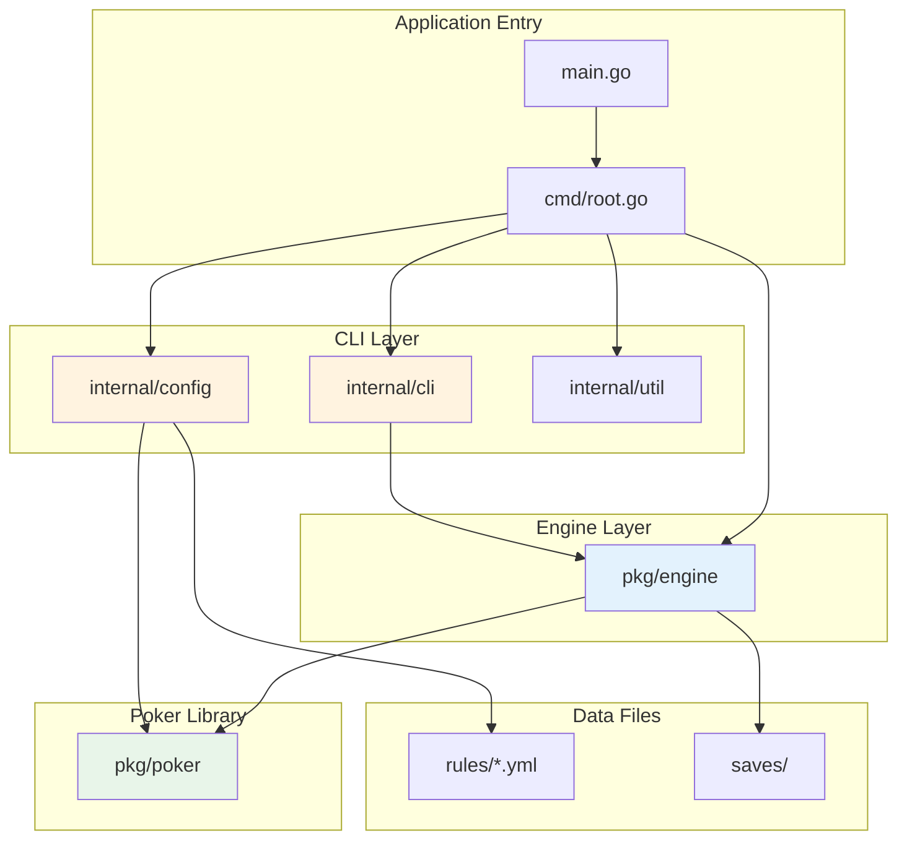

# 디렉토리 구조

이 문서는 `pls7-cli` 프로젝트의 전체 디렉토리 구조를 설명합니다. 모든 디렉토리와 파일의 목적과 책임을 상세히 기술합니다.

## 3계층 아키텍처

프로젝트는 엄격한 3계층 의존성 방향을 따릅니다:

```
CLI 계층 (cmd, internal) --> 엔진 계층 (pkg/engine) --> 포커 라이브러리 (pkg/poker)
```

각 계층은 하위 계층에만 의존하며, 그 반대 방향의 의존성은 허용되지 않습니다. 이러한 관심사 분리는 핵심 엔진의 이식성을 높이고, UI를 교체 가능하게 만듭니다.

## 의존성 다이어그램



## 전체 디렉토리 트리

```
pls7-cli/
├── .claude/                        # Claude Code 설정
│   ├── settings.json               # Claude Code 프로젝트 설정
│   └── skills/                     # 프로젝트 전용 Claude Code 스킬
│       ├── pls7-commit/            # 커밋 메시지 자동 생성
│       ├── pls7-dev-rules/         # 개발 규칙 (TDD, 로깅, 컨벤션)
│       ├── pls7-pr-message/        # PR 제목 및 설명 생성
│       └── pls7-work-log/          # 세션 작업 로그 생성
├── .github/
│   └── workflows/
│       └── go.yml                  # CI 파이프라인: Go 1.23에서 빌드 + 테스트
├── cmd/
│   └── root.go                     # Cobra CLI 진입점, 메인 게임 루프, CombinedActionProvider
├── docs/
│   ├── images/
│   │   └── pls7-cli-architecture-diagram.png  # 아키텍처 다이어그램 이미지
│   ├── issue-history/              # 세션 작업 로그 (YYYYMMDD_topic.md 형식)
│   ├── architecture.md             # 아키텍처 문서 (영문)
│   ├── architecture_ko.md          # 아키텍처 문서 (한국어)
│   ├── directory_structure.md      # 디렉토리 구조 문서 (영문)
│   ├── directory_structure_ko.md   # 이 파일 (한국어)
│   ├── roadmap_v20250827.md        # 최초 프로젝트 로드맵
│   └── roadmap_v20260211.md        # 업데이트된 프로젝트 로드맵
├── internal/
│   ├── cli/
│   │   ├── display.go              # 게임 상태를 터미널에 렌더링
│   │   ├── format.go               # 숫자 포맷팅 (FormatNumber, 콤마 구분자)
│   │   └── input.go                # 플레이어 액션 입력 및 유효성 검증
│   ├── config/
│   │   ├── rules.go                # YAML 규칙 파일을 poker.GameRules로 로딩
│   │   └── rules_test.go           # 규칙 로딩 테스트
│   └── util/
│       └── logger.go               # Logrus 로거 초기화 (개발/운영 모드)
├── pkg/
│   ├── poker/                      # 순수 포커 라이브러리 (내부 의존성 없음)
│   │   ├── card.go                 # Card, Suit, Rank 타입 정의
│   │   ├── deck.go                 # 덱 조작 (셔플, 딜, 결정적 RNG)
│   │   ├── deck_test.go            # 덱 조작 테스트
│   │   ├── combinations.go         # 카드 조합 생성기
│   │   ├── combinations_test.go    # 조합 생성 테스트
│   │   ├── evaluation.go           # 핸드 평가 엔진 (HandRank, HandResult, Hi-Lo)
│   │   ├── evaluation_test.go      # 핸드 평가 테스트
│   │   ├── evaluation_nlh_test.go  # NLH 전용 평가 테스트
│   │   ├── format.go               # 문자열 포맷팅 유틸리티
│   │   ├── format_test.go          # 포맷팅 테스트
│   │   ├── hand_iterator.go        # HandIterator 인터페이스 (Any/Exact 조합 전략)
│   │   ├── odds.go                 # 아웃, 에퀴티, 팟 오즈 계산
│   │   ├── odds_test.go            # 오즈 계산 테스트
│   │   ├── odds_nlh_test.go        # NLH 전용 오즈 테스트
│   │   └── rules.go                # GameRules, HoleCardRules, HandRankingsRules, LowHandRules
│   └── engine/                     # 게임 상태 머신
│       ├── action.go               # ActionType, PlayerAction, ActionProvider 인터페이스
│       ├── ai.go                   # AI 프로파일 (TAG/LAG/TAP/LAP) 및 의사결정 로직
│       ├── ai_test.go              # AI 의사결정 로직 테스트
│       ├── betting_limit.go        # BettingLimitCalculator (PotLimit/NoLimit 전략)
│       ├── betting_limit_test.go   # 베팅 한도 계산 테스트
│       ├── betting_test.go         # 베팅 라운드 메커니즘 테스트
│       ├── bug_repro_test.go       # 버그 재현 테스트
│       ├── config.go               # Difficulty 열거형
│       ├── event.go                # ActionEvent, BlindEvent (UI 통신용)
│       ├── game.go                 # Game 구조체 (중앙 상태), GamePhase 열거형
│       ├── game_test.go            # 게임 상태 관리 테스트
│       ├── integration_test.go     # 통합 테스트 (end-to-end)
│       ├── player.go               # Player 구조체, PlayerStatus 열거형
│       ├── pot.go                  # 팟 분배 (사이드 팟, Hi-Lo 분할)
│       ├── pot_test.go             # 팟 분배 테스트
│       ├── run.go                  # 핸드 진행 (StartNewHand, ProcessAction, Advance 등)
│       ├── run_event_test.go       # 핸드 진행 중 이벤트 발행 테스트
│       ├── turn_test.go            # 턴 관리 테스트
│       ├── save.go                 # GameSaveData 직렬화/역직렬화
│       ├── save_manager.go         # SaveManager (파일 I/O 관리)
│       ├── save_manager_test.go    # SaveManager 테스트
│       └── save_test.go            # 저장/불러오기 직렬화 테스트
├── rules/                          # YAML 게임 변형 정의
│   ├── nlh.yml                     # No-Limit Texas Hold'em (노리밋 텍사스 홀덤)
│   ├── pls.yml                     # Pot-Limit Sampyeong (팟리밋 삼평)
│   ├── pls7.yml                    # Pot-Limit Sampyeong 7-or-Better (팟리밋 삼평 세븐오어베러)
│   ├── plo.yml                     # Pot-Limit Omaha (팟리밋 오마하)
│   └── plo8.yml                    # Pot-Limit Omaha 8-or-Better (팟리밋 오마하 에잇오어베러)
├── saves/                          # 게임 저장 파일 디렉토리
├── main.go                         # 애플리케이션 진입점 (cmd.Execute() 호출)
├── go.mod                          # Go 모듈 정의
├── go.sum                          # Go 모듈 의존성 체크섬
├── CLAUDE.md                       # Claude Code 프로젝트 지침
└── README.md                       # 프로젝트 README
```

## 패키지 및 디렉토리 상세 설명

### 루트 파일

| 파일 | 설명 |
|------|------|
| `main.go` | 애플리케이션 진입점입니다. `cmd.Execute()`를 호출하는 것이 유일한 책임입니다. |
| `go.mod` / `go.sum` | Go 모듈 정의 및 의존성 잠금 파일입니다. |
| `CLAUDE.md` | Claude Code를 위한 프로젝트 지침으로, 빌드 명령어, 아키텍처 요약, 개발 규칙을 포함합니다. |
| `README.md` | 프로젝트 소개 및 사용 가이드입니다. |

### `cmd/` -- 오케스트레이터

`cmd` 패키지는 애플리케이션의 중앙 오케스트레이터입니다. 다른 모든 패키지에 의존하며 이들을 하나로 연결합니다.

- **`root.go`**: Cobra 루트 명령어를 정의하고 CLI 플래그(`-r`: 규칙 변형, `-d`: 난이도)를 설정합니다. 메인 게임 루프를 구현하는 `runGame` 함수를 포함합니다. `CombinedActionProvider`는 사람 플레이어의 입력을 `internal/cli`를 통해, CPU의 결정을 `engine.GetCPUAction`을 통해 라우팅하는 복합 구조체입니다.

### `rules/` -- 게임 변형 정의

포커 규칙의 "데이터베이스" 역할을 하는 YAML 파일들입니다. 각 파일은 다음 항목을 지정하여 하나의 완전한 게임 변형을 정의합니다:

- 홀 카드 수 및 커뮤니티 카드 분배 일정
- 홀 카드 사용 제약 조건 (임의 사용, 정확한 장수 사용)
- 베팅 구조 (팟리밋 또는 노리밋)
- 커스텀 핸드 랭킹 (예: PLS7의 스킵 스트레이트)
- 로우 핸드 평가 규칙 (PLS7, PLO8 등 Hi-Lo 변형용)

| 파일 | 변형 |
|------|------|
| `nlh.yml` | No-Limit Texas Hold'em (노리밋 텍사스 홀덤) |
| `pls.yml` | Pot-Limit Sampyeong (팟리밋 삼평) |
| `pls7.yml` | Pot-Limit Sampyeong 7-or-Better (대표 변형) |
| `plo.yml` | Pot-Limit Omaha (팟리밋 오마하) |
| `plo8.yml` | Pot-Limit Omaha 8-or-Better (팟리밋 오마하 에잇오어베러) |

### `pkg/poker/` -- 순수 포커 라이브러리

**내부 의존성이 전혀 없는** 기반 계층입니다. 이 패키지는 포커 로직이 필요한 어떤 Go 프로젝트에서든 독립적으로 추출하여 사용할 수 있습니다.

| 파일 | 책임 |
|------|------|
| `card.go` | `Card`, `Suit`, `Rank` 타입을 정의하고 문자열 표현을 제공합니다. |
| `deck.go` | 덱 생성, 셔플, 딜링을 담당합니다. 테스트용 결정적 RNG를 지원합니다. |
| `combinations.go` | 주어진 카드 집합에서 가능한 모든 N-choose-K 조합을 생성합니다. |
| `evaluation.go` | 핸드 평가 엔진입니다. 하이 핸드와 로우 핸드 모두에 대해 `HandRank`와 `HandResult`를 결정합니다. 커스텀 랭킹을 지원합니다. |
| `format.go` | 카드, 핸드, 결과를 위한 문자열 포맷팅 유틸리티입니다. |
| `hand_iterator.go` | `HandIterator` 인터페이스와 `AnyHandIterator`, `ExactHandIterator` 전략을 정의합니다. 홀 카드 사용 규칙에 따라 다른 전략을 적용합니다. |
| `odds.go` | 아웃, 에퀴티, 팟 오즈를 계산하여 의사결정을 지원합니다. |
| `rules.go` | `GameRules`, `HoleCardRules`, `HandRankingsRules`, `LowHandRules` 구조체를 정의합니다. 게임 설정을 위한 API 계약 역할을 합니다. |

### `pkg/engine/` -- 게임 상태 머신

포커 게임의 전체 상태와 흐름을 관리합니다. 이 계층은 규칙 적용과 핸드 평가를 위해 `pkg/poker`를 사용합니다.

| 파일 | 책임 |
|------|------|
| `action.go` | `ActionType` 열거형 (Fold, Check, Call, Raise, AllIn), `PlayerAction` 구조체, `ActionProvider` 인터페이스를 정의합니다. |
| `ai.go` | AI 의사결정 시스템입니다. 네 가지 프로파일 유형: Tight-Aggressive (TAG), Loose-Aggressive (LAG), Tight-Passive (TAP), Loose-Passive (LAP). 프로파일은 플레이/레이즈 임계값, 블러프 빈도, 공격성을 제어합니다. `handEvaluator` 함수는 테스트를 위해 주입 가능합니다. |
| `betting_limit.go` | `BettingLimitCalculator` 인터페이스(전략 패턴)와 `PotLimitCalculator`, `NoLimitCalculator` 구현체입니다. |
| `config.go` | `Difficulty` 열거형 (Easy, Medium, Hard)으로 AI 프로파일 분배를 결정합니다. |
| `event.go` | UI 계층과의 게임 이벤트 통신을 위한 `ActionEvent`, `BlindEvent` 구조체입니다. |
| `game.go` | 플레이어, 팟, 커뮤니티 카드, 현재 페이즈, 게임 규칙을 포함하는 중앙 `Game` 구조체입니다. `GamePhase` 열거형 (PreFlop, Flop, Turn, River, Showdown, HandOver)을 정의합니다. |
| `player.go` | 핸드, 칩, 상태, 선택적 AI 프로파일을 가진 `Player` 구조체입니다. `PlayerStatus` 열거형 (Active, Folded, AllIn, Out)을 정의합니다. |
| `pot.go` | 사이드 팟 계산과 Hi-Lo 분할 처리를 포함한 팟 분배 로직입니다. |
| `run.go` | 핸드 상태 머신: `StartNewHand()`, `PrepareNewBettingRound()`, `ProcessAction()`, `AdvanceTurn()`, `Advance()`, `DistributePot()`, `CleanupHand()`. |
| `save.go` | 게임 영속성을 위한 `GameSaveData` 구조체의 직렬화/역직렬화입니다. |
| `save_manager.go` | 게임 상태를 디스크에 저장하고 불러오는 파일 I/O를 관리하는 `SaveManager`입니다. |

### `internal/` -- 애플리케이션 전용 코드

이 CLI 애플리케이션에만 해당하는 내부 패키지입니다. Go의 `internal` 컨벤션에 의해 외부 프로젝트에서의 임포트가 차단됩니다.

#### `internal/cli/` -- 터미널 UI

| 파일 | 책임 |
|------|------|
| `display.go` | `engine.Game` 상태를 터미널에 렌더링합니다: 플레이어 핸드, 커뮤니티 카드, 팟 크기, 칩 수량, 액션 히스토리. |
| `format.go` | 숫자 포맷팅 유틸리티로, 특히 칩 수량에 콤마 구분자를 추가하는 `FormatNumber` 함수를 포함합니다. |
| `input.go` | 플레이어에게 액션(fold, check, call, raise)을 입력받고 사용 가능한 액션에 대해 유효성을 검증합니다. |

#### `internal/config/` -- 규칙 로딩

| 파일 | 책임 |
|------|------|
| `rules.go` | `rules/` 디렉토리의 YAML 파일을 읽어 `poker.GameRules` 구조체로 변환합니다. 데이터 파일과 포커 라이브러리 사이의 다리 역할을 합니다. |
| `rules_test.go` | YAML 파싱 및 `GameRules` 구성의 정확성을 검증하는 테스트입니다. |

#### `internal/util/` -- 유틸리티

| 파일 | 책임 |
|------|------|
| `logger.go` | 개발 모드와 운영 모드에 적합한 설정으로 `logrus` 로거를 초기화합니다. |

### `docs/` -- 문서

| 파일 / 디렉토리 | 설명 |
|-----------------|------|
| `architecture.md` | 상세 아키텍처 문서 (영문). |
| `architecture_ko.md` | 상세 아키텍처 문서 (한국어). |
| `directory_structure.md` | 디렉토리 구조 문서 (영문). |
| `directory_structure_ko.md` | 이 파일 -- 디렉토리 구조 문서 (한국어). |
| `roadmap_v20250827.md` | 최초 프로젝트 로드맵. |
| `roadmap_v20260211.md` | 업데이트된 프로젝트 로드맵. |
| `images/` | 문서에서 참조하는 다이어그램 이미지. |
| `issue-history/` | `YYYYMMDD_topic.md` 형식의 세션 작업 로그. |

### `.claude/` -- Claude Code 설정

| 파일 / 디렉토리 | 설명 |
|-----------------|------|
| `settings.json` | Claude Code 프로젝트 수준 설정. |
| `skills/pls7-commit/` | 커밋 메시지 자동 생성 스킬. |
| `skills/pls7-dev-rules/` | 전체 개발 규칙 스킬 (TDD, 로깅, 컨벤션). |
| `skills/pls7-pr-message/` | PR 제목 및 설명 생성 스킬. |
| `skills/pls7-work-log/` | 세션 작업 로그 생성 스킬. |

### `.github/` -- CI/CD

| 파일 | 설명 |
|------|------|
| `workflows/go.yml` | Go 1.23에서 `go build -v ./...`와 `go test -v ./...`를 실행하는 GitHub Actions 워크플로우. |

### `saves/` -- 게임 저장 파일

플레이어가 진행 중인 게임을 저장할 때 직렬화된 게임 상태 파일이 저장되는 런타임 디렉토리입니다.

## 관심사의 분리

디렉토리 구조는 모든 수준에서 깔끔한 분리를 강제합니다:

1. **데이터 vs. 로직**: 게임 규칙은 `rules/*.yml`에 순수 데이터로 존재하며, 이를 해석하는 코드와 분리되어 있습니다.
2. **라이브러리 vs. 애플리케이션**: `pkg/`는 재사용 가능한 라이브러리를, `internal/`은 애플리케이션 전용 코드를 포함합니다.
3. **핵심 vs. UI**: 포커 라이브러리(`pkg/poker`)와 게임 엔진(`pkg/engine`)은 자신이 어떻게 표시되는지 알지 못합니다. 터미널 UI(`internal/cli`)는 엔진을 수정하지 않고도 웹 또는 GUI 프론트엔드로 교체할 수 있는 얇은 래퍼입니다.
4. **상태 vs. 행위**: `GameRules` 구조체(순수 데이터)는 `Game`(상태를 가진 행위)과 분리되어 있어, 동일한 엔진으로 어떤 포커 변형이든 실행할 수 있습니다.
